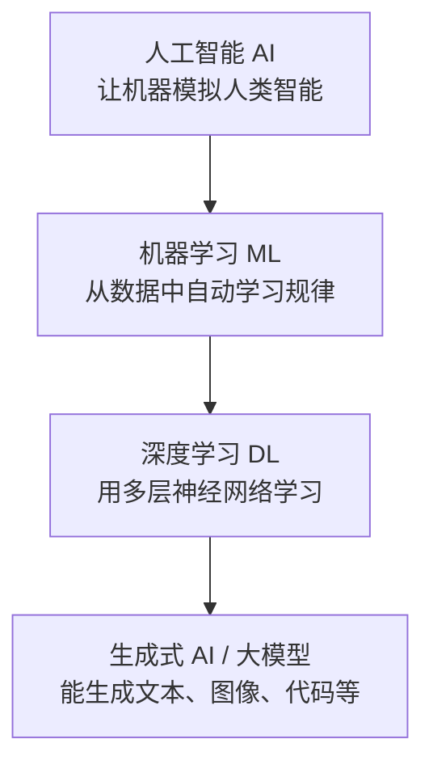
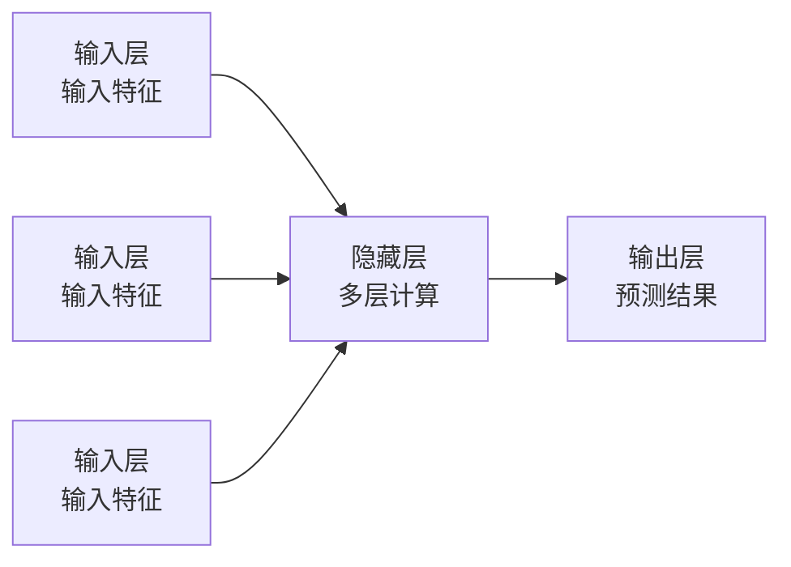

> 面向零基础起步，梳理 AI 的核心概念、发展脉络与关键术语，为后续学习 AI Agent、大模型应用打好地基。

## 一、AI 是什么

**人工智能（Artificial Intelligence，AI）**：让计算机模拟人类智能行为的技术，包括理解语言、识别图像、推理决策、生成内容等。

> 个人笔记：可以简单理解为"机器通过程序和数据，做出像人一样（甚至超过人）的智能行为"。我们日常说的"AI 很聪明"，本质上是在说"模型在大量数据上学到了规律"。

### 1.1 四个概念的关系

AI 是一个大伞，下面层层递进：



| 层级 | 含义 | 典型例子 |
| --- | --- | --- |
| 人工智能（AI） | 一切让机器表现智能的技术总称 | 专家系统、机器人、下棋程序 |
| 机器学习（ML） | 不写死规则，让机器从数据中自己学 | 垃圾邮件识别、房价预测 |
| 深度学习（DL） | 用多层神经网络实现机器学习 | 人脸识别、语音识别、AlphaGo |
| 生成式 AI / 大模型 | 以海量数据训练的大规模模型，能生成新内容 | ChatGPT、豆包、Midjourney |

### 1.2 强 AI 与弱 AI

- **弱 AI（狭义 AI）**：只擅长单一任务，如人脸识别、下棋、翻译。目前所有商用 AI 都属于这一类。
- **强 AI（通用 AI，AGI）**：像人一样具备通用智能，能胜任任何智力任务。目前尚未实现，是各大厂商追逐的目标。

---

<a id="sec2"></a>
## 二、AI 发展简史

AI 并不是新概念，已经有 70 多年历史，期间经历了两轮"寒冬"和爆发。

| 时间 | 事件 | 意义 |
| --- | --- | --- |
| 1950 年 | 图灵提出"图灵测试" | 首次提出判断机器是否智能的标准 |
| 1956 年 | 达特茅斯会议 | "人工智能"一词诞生，AI 学科成立 |
| 1974-1980 年 | 第一次 AI 寒冬 | 算力不足、预期落空，资金撤离 |
| 1997 年 | IBM 深蓝战胜国际象棋冠军 | 专用 AI 在特定领域超越人类 |
| 2012 年 | AlexNet 赢得 ImageNet 图像识别大赛 | 深度学习崛起，GPU 训练成为主流 |
| 2016 年 | AlphaGo 战胜李世石 | 深度强化学习的里程碑 |
| 2017 年 | Google 发表《Attention Is All You Need》 | Transformer 架构诞生，奠定大模型基础 |
| 2020 年 | GPT-3 发布（1750 亿参数） | 证明"大力出奇迹"，规模越大能力越强 |
| 2022 年 11 月 | ChatGPT 发布 | AI 走进大众，全球用户破亿 |
| 2023-2025 年 | GPT-4、Claude、Gemini、DeepSeek 等相继发布 | 多模态、推理能力持续进化，Agent 兴起 |

> 个人笔记：记住一条主线即可——**先有规则（专家系统）→ 再有学习（机器学习）→ 再到深度神经网络（深度学习）→ 最后是海量参数堆出来的大模型（生成式 AI）**。

---

<a id="sec3"></a>
## 三、机器学习基础

**机器学习（Machine Learning）**：不靠人写规则，而是给机器大量数据，让它自己找出规律，并用规律做预测。

### 3.1 三大学习方式

| 方式 | 数据特点 | 解决什么问题 | 例子 |
| --- | --- | --- | --- |
| 监督学习 | 数据带标签（正确答案） | 分类、回归 | 垃圾邮件识别、房价预测 |
| 无监督学习 | 数据无标签 | 聚类、降维 | 用户分群、异常检测 |
| 强化学习 | 无数据，靠试错+奖励 | 决策、控制 | AlphaGo、自动驾驶 |

**举例理解监督学习**：

```
输入：一张图片（猫/狗）
标签：这张图是"猫"          ← 正确答案
训练：让模型反复看"图片 + 标签"，学会区分猫和狗
预测：给一张新图片，模型判断是猫还是狗
```

### 3.2 机器学习核心流程

```
原始数据 → 数据清洗 → 特征工程 → 划分训练集/测试集 → 训练模型 → 评估 → 部署预测
```

### 3.3 关键概念

- **特征（Feature）**：用来判断的输入信息，如"颜色、大小、毛发长度"。
- **标签（Label）**：正确答案，如"猫"或"狗"。
- **训练集 / 测试集**：训练集用来教模型，测试集用来考模型——用没见过的数据检验学习效果。
- **过拟合（Overfitting）**：模型把训练数据背得太熟，反而对没见过的数据表现差。好比学生死记硬背例题，考试换了个问法就不会了。
- **模型（Model）**：学完规律后的"大脑"，一个可复用的函数/程序。

---

<a id="sec4"></a>
## 四、深度学习与神经网络

**深度学习**是机器学习的一个分支，核心是**人工神经网络**——模仿人脑神经元连接的方式处理信息。

### 4.1 神经网络长什么样



- **输入层**：接收原始数据（如像素、文本）
- **隐藏层**：一层层提取特征，层数越多代表"深度"越深
- **输出层**：给出最终结果（如"是猫的概率 95%"）

### 4.2 训练的关键机制

| 机制 | 通俗解释 | 类比 |
| --- | --- | --- |
| 权重（Weight） | 每个输入的重要程度，训练就是不断调整它 | 调音量旋钮 |
| 激活函数 | 决定神经元"要不要被激活"，引入非线性 | 开关 |
| 损失函数 | 衡量预测和真实答案差多少 | 考试的错题数 |
| 梯度下降 | 朝"错误变小"的方向微调权重 | 下山时顺着最陡的方向走 |
| 反向传播 | 从输出层往回逐层更新权重 | 错题逐题回溯原因 |

### 4.3 主流网络类型

- **CNN（卷积神经网络）**：擅长图像，通过卷积核提取局部特征。
- **RNN（循环神经网络）**：擅长序列，如语音、文本，但长文本记忆差。
- **Transformer（变换器）**：2017 年提出，用**注意力机制**处理长文本，是大模型的基础架构。如今文本、图像、视频模型几乎都用它。

> 个人笔记：不需要背公式，记住结论即可——**深度学习 = 多层神经网络 + 大量数据 + 算力**。它之所以 2012 年后爆发，核心是三件事同时到位：GPU 算力变便宜、互联网积累了海量数据、算法（如 Transformer）不断突破。

---

<a id="sec5"></a>
## 五、大语言模型（LLM）

**大语言模型（Large Language Model，LLM）**：在海量文本上训练出来的超大规模神经网络，能理解、生成和处理自然语言。ChatGPT、豆包、DeepSeek 都是 LLM 产品。

### 5.1 常用术语

| 术语 | 含义 |
| --- | --- |
| Token | 文本的最小切分单位，中文一个字约 1-2 个 token，计费和上下文都按它算 |
| 上下文窗口 | 模型一次最多能"记住"的 token 数，越大越能处理长文档 |
| 参数 | 模型的"神经元连接数"，越大代表知识容量越大（GPT-3 有 1750 亿） |
| 温度（Temperature） | 控制回答随机性，低=严谨稳定，高=发散有创意 |
| 幻觉（Hallucination） | 模型一本正经地编造不存在的答案，是 LLM 固有缺陷 |
| 知识截止 | 训练数据的时间点，之后的事模型不知道 |

### 5.2 训练的三个阶段

```
第一阶段 预训练（Pre-training）
  用海量互联网文本"读万卷书"，学语言规律和世界知识
      ↓
第二阶段 监督微调（SFT）
  用人工标注的问答对教它"怎么好好回答问题"
      ↓
第三阶段 人类反馈强化学习（RLHF）
  让人类打分，奖励好回答、惩罚差回答，对齐人类偏好
```

### 5.3 提示词工程（Prompt Engineering）

Prompt 是给模型的指令，质量直接决定回答质量。基本公式：

```
角色 + 任务 + 背景 + 要求 + 示例 + 输出格式
```

示例：

```text
你是一位网络排障专家（角色）。
用户的路由器能连上 WiFi 但无法上网（背景/任务）。
请按以下顺序排查，给出 3 步操作建议，每步不超过 50 字，并用列表输出（要求/格式）。
```

### 5.4 主要局限

- **幻觉**：可能编造事实，关键信息必须人工核验
- **知识截止**：需要联网搜索补充最新信息（RAG/联网模式）
- **上下文限制**：超长对话会"忘记"前面内容
- **无自主行动能力**：只会回答，不会自己做事——这正是 AI Agent 要解决的问题

---

<a id="sec6"></a>
## 六、AI Agent 入门

**AI Agent（智能体）**：以大模型为"大脑"，能**理解目标 → 拆解计划 → 调用工具 → 执行多步任务 → 根据结果反思调整**的自主系统。它是 AI 从"聊天"走向"干活"的关键一步。

### 6.1 LLM 与 Agent 的区别

| 对比项 | 普通 LLM（聊天） | AI Agent |
| --- | --- | --- |
| 目标 | 回答用户问题 | 完成一个任务 |
| 过程 | 单轮问答 | 多步自主规划、执行 |
| 工具 | 不能调用 | 可调用 API、搜索、代码、软件 |
| 记忆 | 限于上下文 | 有长期记忆，可跨任务使用 |
| 例子 | 问它"明天天气如何" | 它自动查天气、订机票、写行程、发邮件 |

### 6.2 Agent 的核心组件

```
┌──────────────────────────────────────┐
│                AI Agent               │
│  ┌──────┐ ┌──────┐ ┌──────┐ ┌──────┐ │
│  │ 规划  │ │ 记忆  │ │ 工具  │ │ 反思  │ │
│  │Planning│ │Memory│ │Tools │ │Reflect│ │
│  └──────┘ └──────┘ └──────┘ └──────┘ │
└──────────────────────────────────────┘
        │
        ▼ 以 LLM 大模型作为"大脑"
```

| 组件 | 作用 | 类比 |
| --- | --- | --- |
| 规划（Planning） | 把大任务拆成小步骤，决定先做什么 | 项目经理 |
| 记忆（Memory） | 记住上下文和历史任务 | 工作笔记 |
| 工具（Tools） | 调用搜索、代码、API、文件等外部能力 | 双手和工具包 |
| 反思（Reflection） | 检查结果，错了就调整重来 | 复盘 |

### 6.3 常见框架与平台

- **开发框架**：LangChain、LlamaIndex（代码开发用）
- **低代码平台**：Coze（扣子）、Dify、飞书智能伙伴（无代码拖拽搭建）
- **典型应用**：智能客服、文档处理、数据分析、自动化办公、编程助手

> 个人笔记：学 Agent 不用一上来啃框架。先在低代码平台搭一个"能搜资料 + 能写文档"的智能体，理解"规划-工具-记忆"是怎么转起来的，再去看代码框架。

---

<a id="sec7"></a>
## 七、AI 应用场景与常用工具

| 场景 | 常用工具/产品 |
| --- | --- |
| 对话问答 | ChatGPT、豆包、Claude、Gemini、DeepSeek |
| 编程助手 | GitHub Copilot、Cursor、通义灵码 |
| 图像生成 | Midjourney、即梦、豆包 AI 生图 |
| 视频生成 | 即梦、可灵、Sora |
| 办公效率 | 飞书智能伙伴、豆包办公（文档/表格/PPT/会议） |
| 语音 | 语音转写、实时翻译、AI 配音 |
| 学习研究 | 学术文献检索、知识库问答、笔记整理 |

> 个人笔记：挑 1-2 个主力工具用熟，比收集一堆工具更有价值。建议把"对话 + 办公"作为日常主力场景。

---

<a id="sec8"></a>
## 八、学习路径与资源

### 8.1 推荐学习路径

```
第一步 会用（1-2 周）
  每天用对话式 AI 解决实际问题，练提示词，建立"AI 能干什么"的直觉
      ↓
第二步 懂概念（2-4 周）
  掌握本文的核心概念：机器学习、神经网络、LLM、Token、Agent
      ↓
第三步 动手做（1-2 个月）
  学一点 Python，在低代码平台（Coze/Dify）搭一个自己的智能体
      ↓
第四步 深入原理（持续）
  学提示词工程 → RAG 检索增强 → 微调 → Agent 框架源码
```

### 8.2 推荐资源

- **视频（通俗易懂）**：3Blue1Brown《神经网络》系列、李宏毅《机器学习》公开课
- **系统课程**：吴恩达《Machine Learning Specialization》、Hugging Face 免费课程
- **中文社区**：知乎 AI 话题、公众号（机器之心、量子位）
- **动手实践**：Kaggle（数据竞赛）、GitHub 开源项目、Coze/Dify 官方文档
- **关注前沿**：各大模型发布会、arXiv 论文、Paper with Code

---

> 下一篇建议：《机器学习入门笔记》或《大语言模型应用笔记》——学完本文的底层概念后，可以按上面路径继续深入。
