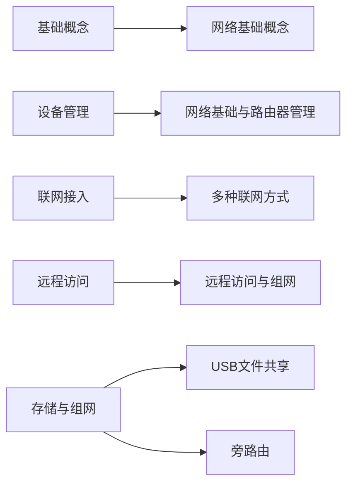

> 基于「李仁东的实验报告」整理的路由器 / 网络知识库，按知识主题组织。可用于售前配置指导、售后排障速查与培训材料。

## 知识地图

> 阅读顺序
> 先读「基础概念」网络基础概念 打底，再按场景进入对应操作笔记。

## 主题清单

| 分类 | 主题 | 定位 | 覆盖内容 | 笔记 |
|------|------|------|---------|------|
| 基础概念 | 网络基础概念 | 通用网络概念与排障方法（不绑定具体设备） | IP/子网掩码/网关/DNS/MAC/NAT、家用路由器、Wi-Fi、协议端口、排障方法、实用知识 | 网络基础概念 |
| 设备管理 | 网络基础与路由器管理 | GL.iNet 路由器管理操作 | WAN/LAN、web 与 SSH、联网判断、LAN 冲突、DHCP/静态 IP、客户端与无线管理、Guest 隔离、SSH 命令、U-Boot 刷机 | 网络基础与路由器管理 |
| 联网接入 | 多种联网方式 | 接入方案与选型 | Repeater 中继、蜂窝 Cellular、SIMPoYo uFi、Multi-WAN 多链路 | 多种联网方式 |
| 远程访问 | 远程访问与组网 | 远程运维方案 | KVM、端口转发与 DMZ、GoodCloud、Tailscale | 远程访问与组网 |
| 文件共享 | USB 文件共享 | 外置存储共享 | Samba、WebDAV、DLNA、WAN 访问安全 | USB文件共享 |
| 分流组网 | 旁路由 | 按需分流 | 旁路由组网、VPN 分流 | 旁路由 |

## 使用建议

- **先打底**：不熟悉网络概念时，先读 网络基础概念（IP、掩码、网关、DNS、排障方法等通用知识）
- **售前配置指导**：按客户需求查 网络基础与路由器管理 的联网与无线配置、多种联网方式 的接入方案选型
- **售后排障**：
  - 接入类问题 → 多种联网方式（中继/蜂窝/多 WAN）
  - 远程访问类问题 → 远程访问与组网（端口转发/GoodCloud/Tailscale）
  - 存储共享类问题 → USB文件共享
  - 分流类问题 → 旁路由
- **与既有笔记联动**：路由器篇、IPv6 端口转发、KVM篇（售后排障场景）

## 来源说明

本主题整理自 GL.iNet 路由器系列实验（实验1 网络设置、实验2 客户端连接、实验3 远程KVM、实验4 Repeater、实验6 端口转发、实验7 GoodCloud、实验9 Cellular、实验11 SIMPoYo uFi、实验12 USB共享、实验13 Multi-WAN、实验14 Tailscale、实验15 SSH & U-Boot、旁路由）。内容已按知识点重组，便于查阅。
