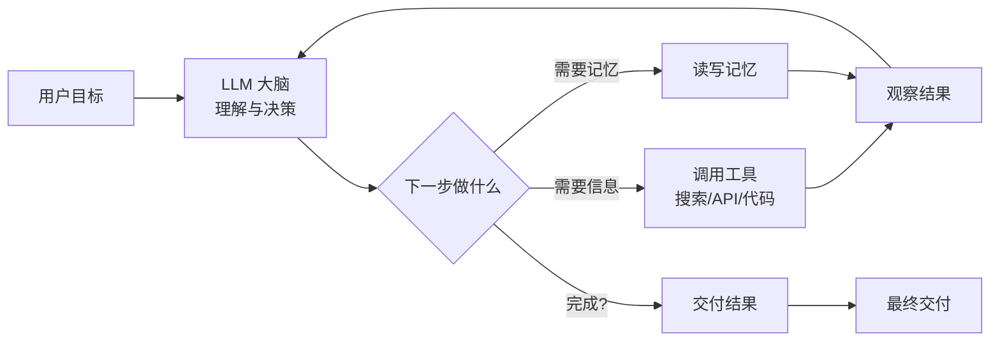
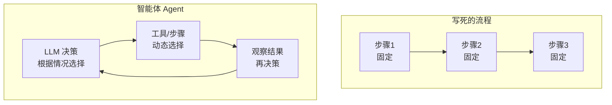
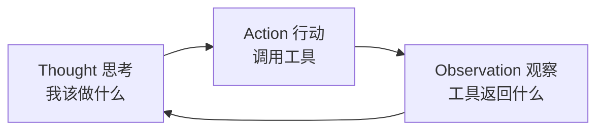
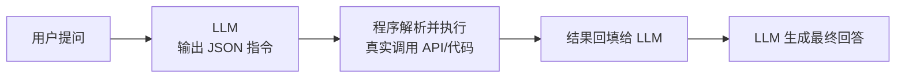
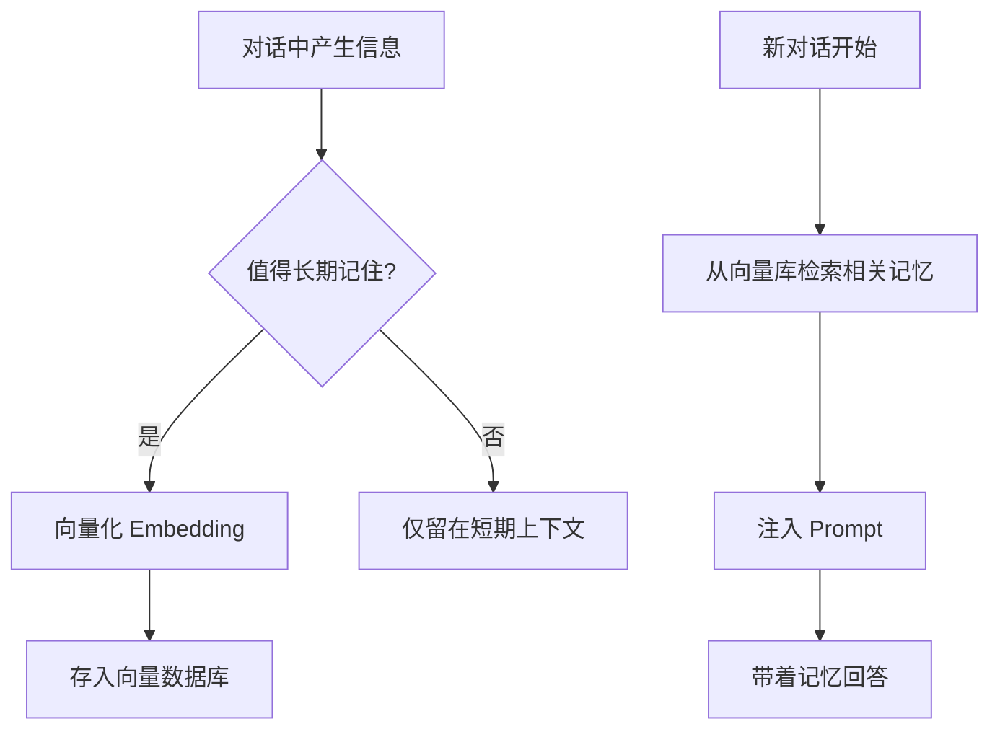
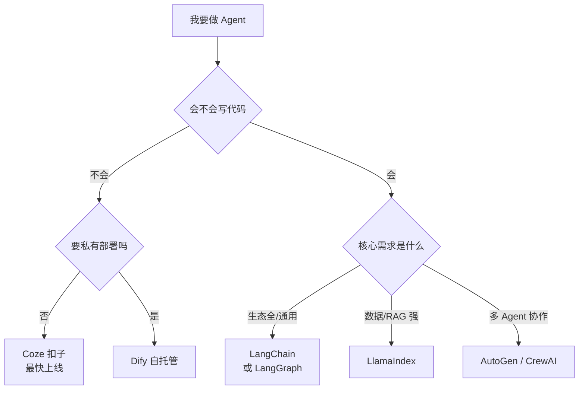
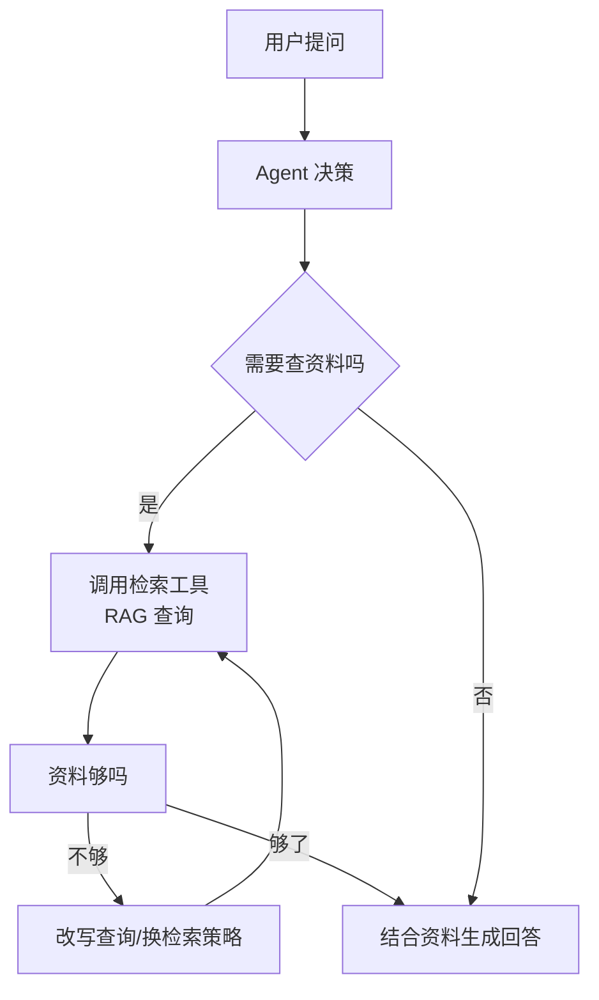

> 面向零基础起步，承接《AI 基础》中的 Agent 入门，深入梳理 AI Agent 的核心模式（ReAct）、工具调用与 MCP、记忆系统、主流框架，以及 Agent 与 RAG 的结合方式，最后给出从零搭建的实操路径。

## 目录

- [一、Agent 到底在解决什么问题](#sec1)
- [二、Agent 与 LLM、工作流、RAG 的区别](#sec2)
- [三、核心架构：四组件再拆解](#sec3)
- [四、核心模式：ReAct（推理 + 行动循环）](#sec4)
- [五、工具调用：Function Calling 与 MCP](#sec5)
- [六、记忆系统：短期、长期与向量记忆](#sec6)
- [七、主流框架与平台对比](#sec7)
- [八、Agent + RAG：知识型智能体](#sec8)
- [九、动手搭建：从低代码到 Python](#sec9)
- [十、常见问题与局限](#sec10)
- [十一、学习资源](#sec11)

---

<a id="sec1"></a>
## 一、Agent 到底在解决什么问题

### 1.1 回顾：LLM 的"最后一公里"问题

普通 LLM 很能"说"，但很不会"做"：

| 能力 | 普通 LLM | 你希望 AI 做到 |
| --- | --- | --- |
| 回答"怎么查快递" | 给你一段操作步骤 | 直接帮你查好并汇报 |
| 回答"帮我订机票" | 给你订票攻略 | 自动比价、下单、发行程 |
| 回答"看看这个数据" | 让你手动导出上传 | 自己打开文件、分析、出报告 |

差的那一步，就是**行动能力**。Agent 要解决的核心问题只有一个：**让 AI 从"给建议"变成"把事情办完"**。

### 1.2 Agent 的完整定义

**AI Agent（智能体）**：以大模型为"大脑"，能**理解目标 → 拆解计划 → 调用工具 → 执行多步任务 → 根据结果反思调整**的自主系统。



> 个人笔记：Agent 和普通 LLM 的关系，就像"实习生"和"只会答题的学霸"。学霸能答对所有题，但实习生能跑腿办事——关键在于实习生手里有工具、知道怎么拆任务、办砸了会回头调整。Agent 就是给学霸配上手脚和工具包。

---

<a id="sec2"></a>
## 二、Agent 与 LLM、工作流、RAG 的区别

这几个概念经常被混在一起，先分清它们各管什么：

| 概念 | 本质 | 打个比方 | 举例 |
| --- | --- | --- | --- |
| **LLM（大模型）** | 生成能力 | 一个很聪明的大脑 | 回答、写作、翻译 |
| **Workflow（工作流）** | 固定流程 | 流水线作业 | 固定的"查库存→算价格→生成订单"步骤 |
| **Agent（智能体）** | 自主决策 | 一个会自己拿主意的员工 | 根据情况决定先查什么、再做什么 |
| **RAG（知识增强）** | 知识来源 | 给大脑配的图书馆 | 让模型回答私有知识库的问题 |

### 2.1 Workflow 与 Agent 的本质区别



- **Workflow**：步骤是**写死的**。适合流程稳定、输入输出明确的场景（如固定格式的工单处理）。
- **Agent**：步骤是**模型现场决定的**。适合需要随机应变、有多条路径的场景（如"帮我把这件事办妥"）。

> 关键认知：Agent 不是"更高级的工作流"，而是**把流程控制权从人交给了模型**。什么时候用工作流、什么时候用 Agent，判断标准是——**这条路是否只有一种走法**。

### 2.2 Agent 与 RAG 不是二选一

- RAG 是"知识组件"：给模型提供资料；
- Agent 是"行动框架"：决定怎么用资料、怎么完成任务；
- **Agent 可以把 RAG 当作自己的一个工具**（见第八节），两者是组合关系，不是竞争关系。

---

<a id="sec3"></a>
## 三、核心架构：四组件再拆解

《AI 基础》里已经介绍了 Agent 的四大组件，这里逐个深入：

### 3.1 规划（Planning）

| 规划能力 | 作用 | 类比 |
| --- | --- | --- |
| 任务分解（Task Decomposition） | 把大目标拆成可执行的小步骤 | 把"搬家"拆成"打包→叫车→搬运→归位" |
| 子目标排序 | 决定先做哪步、哪些可以并行 | 排优先级 |
| 反思修正 | 执行中发现偏差，调整原计划 | 计划赶不上变化时改计划 |

常见实现方式：
- **一次性规划**：开头就把步骤全列出来（适合步骤明确的任务）；
- **逐步规划**：走一步看一步（适合不确定性高的任务）。

### 3.2 记忆（Memory）

详见第六节，先记住结论：**短期记忆 = 当前对话上下文；长期记忆 = 存下来的历史事实与偏好**。

### 3.3 工具（Tools）

Agent 的"双手"，常见几类：

| 工具类型 | 例子 | 解决什么问题 |
| --- | --- | --- |
| 搜索工具 | 网页搜索、新闻检索 | 知识截止、实时信息 |
| 代码执行 | Python 解释器、代码沙箱 | 计算、数据处理、绘图 |
| 结构化接口 | 天气 API、订单 API、数据库 | 连接真实业务系统 |
| 文件操作 | 读写文档、Excel、PDF | 办公自动化 |
| 浏览器 | 打开网页、点击、填表 | 网页端操作 |
| 其他模型 | 文生图、语音合成 | 多模态能力扩展 |

### 3.4 反思（Reflection）

- **自我评估**：这一步的结果对吗？是否偏离目标？
- **错误修正**：换一种方式重试，而不是硬着头皮继续；
- **停止条件**：什么时候算"办完了"，避免无限循环。

> 个人笔记：规划、记忆、工具、反思这四件事，前三个好理解，**反思最容易被忽略但最影响成败**。没有反思的 Agent 会一条路走到黑——查不到资料就反复查同一份，答非所问还继续往下做。反思就是给 Agent 装"回头是岸"的能力。

---

<a id="sec4"></a>
## 四、核心模式：ReAct（推理 + 行动循环）

### 4.1 ReAct 是什么

**ReAct**（Reasoning + Acting，推理 + 行动）是目前最主流的 Agent 工作模式，由 2022 年论文 *ReAct: Synergizing Reasoning and Acting in Language Models* 提出。

核心思想一句话：**让模型"边想边做"——想一步、做一步、看结果、再想下一步**。

### 4.2 三步循环



| 环节 | 内容 | 举例 |
| --- | --- | --- |
| **Thought（思考）** | 模型用自然语言说出推理过程 | "用户要查明天深圳天气，我需要先调用天气 API" |
| **Action（行动）** | 模型输出要调用的工具和参数 | `search_weather(city="深圳", date="明天")` |
| **Observation（观察）** | 程序执行工具，把结果回填给模型 | "深圳 明天 多云 26-32°C" |

循环直到模型认为信息足够、可以给出最终答案为止。

### 4.3 一个完整的 ReAct 示例

用户提问："明天深圳适合户外跑步吗？"

```
Thought: 我需要先获取明天的天气，再判断是否适合跑步。
Action: search_weather(city="深圳", date="明天")
Observation: 多云，26-32°C，湿度 85%，空气质量良

Thought: 温度偏高、湿度大，跑起来可能闷热，但空气质量良。再查一下降水概率。
Action: search_weather_detail(city="深圳", date="明天")
Observation: 降水概率 20%，下午可能有阵雨

Thought: 降水概率不高，早晨跑步可行，建议避开下午。可以给出综合建议了。
Answer: 明天深圳早晨适合跑步（26°C、湿度略高注意补水），下午有 20% 阵雨概率，建议晨跑并带水。
```

> 个人笔记：ReAct 的价值在于**把"推理过程"显式地写出来**。这样做有三个好处：一是模型边写边理清思路，答案更可靠；二是每步工具调用都有据可查，出错了能定位；三是整个过程人看得懂，可审计。

### 4.4 其他常见模式

| 模式 | 思路 | 适用场景 |
| --- | --- | --- |
| **ReAct** | 边想边做，循环推进 | 通用默认方案 |
| **Plan-and-Execute** | 先整体规划，再逐步执行 | 步骤多但可预见的长任务 |
| **Reflexion** | 做完后自我复盘，把教训存入记忆 | 需要从错误中学习的任务 |
| **多 Agent 协作** | 多个 Agent 分工（如"研究员+写手+审查员"） | 复杂流水线任务 |

> 注意：模式之间不互斥，实际系统经常混用——先 Plan 分解，再用 ReAct 执行每步，最后 Reflexion 复盘。

---

<a id="sec5"></a>
## 五、工具调用：Function Calling 与 MCP

### 5.1 Function Calling：让模型"开口要工具"

**Function Calling（函数调用）**：模型在回答时，不是直接输出文字，而是输出一段**结构化指令**，告诉程序"我要调用哪个函数、传什么参数"，由程序真正执行，再把结果还给模型。

流程：



模型输出的指令示例：

```json
{
  "tool": "search_weather",
  "arguments": {
    "city": "深圳",
    "date": "2026-09-19"
  }
}
```

> 关键认知：**模型不真正执行任何操作**。它只负责"说"要调用什么，真正执行的是外部程序——这个设计保证了安全和可控：程序可以在执行前校验参数、控制权限、记录日志。

### 5.2 工具的定义方式

使用 Function Calling 前，要把工具的"说明书"告诉模型（通常叫 **Tool Schema**）：

```json
{
  "name": "search_weather",
  "description": "查询指定城市某天的天气",
  "parameters": {
    "type": "object",
    "properties": {
      "city": { "type": "string", "description": "城市名" },
      "date": { "type": "string", "description": "日期" }
    },
    "required": ["city", "date"]
  }
}
```

模型读了这个 schema，就知道"什么时候该用、参数怎么填"。

### 5.3 MCP：AI 世界的"USB-C 接口"

**MCP**（Model Context Protocol，模型上下文协议）由 Anthropic 于 2024 年提出，目标是解决工具接入的碎片化问题。

| 对比 | 没有 MCP 之前 | 有了 MCP |
| --- | --- | --- |
| 接一个新工具 | 每个 AI 应用单独写适配代码 | 工具方按 MCP 标准暴露一次，所有 AI 都能用 |
| 工具数量 | 每个应用只能接自己写过的 | 生态共享，即插即用 |
| 类比 | 每个设备要专用充电线 | 统一 USB-C 接口 |

MCP 的组成：

- **MCP Server（服务端）**：工具/数据提供方，把能力暴露成标准接口；
- **MCP Client（客户端）**：AI 应用侧，发现并调用这些工具；
- **传输方式**：本地（stdio）或远程（HTTP/SSE）。

> 个人笔记：可以这样理解——**Function Calling 是"单个模型怎么调单个工具"的机制，MCP 是"全行业工具怎么统一接入"的标准**。2025 年后 MCP 生态快速扩张，主流框架（LangChain、Claude、豆包、飞书等）都已支持。学 Agent 可以先用好 Function Calling，再了解 MCP 这个行业趋势。

---

<a id="sec6"></a>
## 六、记忆系统：短期、长期与向量记忆

Agent 的"记性"分两层：

### 6.1 短期记忆（Working Memory）

- 就是**当前对话的上下文**，存在模型上下文窗口里；
- 问题：上下文窗口有限，对话一长就"忘"；
- 解法：**摘要压缩**（把早期对话浓缩成摘要）、**滑动窗口**（只保留最近 N 轮）、**关键信息提取**（只留事实类内容）。

### 6.2 长期记忆（Long-term Memory）

跨对话、跨会话保存的信息，通常存在**向量数据库**里：

| 记忆类型 | 存什么 | 例子 |
| --- | --- | --- |
| 事实记忆 | 用户说过的事实 | "用户是售后工程师，负责路由器产品" |
| 偏好记忆 | 用户的习惯偏好 | "用户喜欢简洁的回答，讨厌官方套话" |
| 经验记忆 | 历史任务的教训 | "上次查 KVM 问题，先去查日志再看配置" |

### 6.3 记忆的读写流程



> 关键点：长期记忆本质就是"**用向量检索，把历史相关信息重新找回来塞进上下文**"——和 RAG 的原理完全一样，只是检索对象从"知识文档"换成了"历史记忆"。

---

<a id="sec7"></a>
## 七、主流框架与平台对比

| 框架/平台 | 类型 | 特点 | 适合谁 |
| --- | --- | --- | --- |
| **Coze（扣子）** | 低代码平台 | 字节出品，拖拽搭建，插件生态丰富，中文友好 | 零代码快速做原型/产品 |
| **Dify** | 开源低代码平台 | 自托管，RAG 能力强，工作流可视化 | 想做自己可控的应用 |
| **LangChain** | Python 开发框架 | 生态最全、资料最多，组件丰富 | 开发者，深入学习首选 |
| **LangGraph** | Python 开发框架 | LangChain 官方，专做有状态多步 Agent | 生产级复杂 Agent |
| **LlamaIndex** | Python 开发框架 | 数据与 RAG 最强，Agent 与数据结合好 | 知识密集型应用 |
| **AutoGen** | Python 开发框架 | 微软出品，多 Agent 对话协作 | 多 Agent 研究/实验 |
| **CrewAI** | Python 开发框架 | 角色分工（Role/Goal/Backstory），上手简单 | 多 Agent 团队模拟 |
| **飞书智能伙伴** | 办公平台 | 与企业办公、文档、审批打通 | 企业内部应用 |

### 选型建议



> 个人笔记：学习顺序建议——**先用 Coze 或 Dify 搭一个能跑的 Agent（一晚上搞定），再看 LangChain 的官方教程理解底层，最后用 LangGraph 做一个生产级小项目**。不要一上来就啃框架源码，先建立"规划-工具-记忆-反思"的直觉最重要。

---

<a id="sec8"></a>
## 八、Agent + RAG：知识型智能体

### 8.1 为什么要结合

- 纯 RAG：只能"回答问题"，不能"处理事情"；
- 纯 Agent：模型知识有限，回答私有问题时没有资料支撑；
- **Agent + RAG**：让 Agent 既"有知识"又"会办事"。

### 8.2 两种结合方式

| 方式 | 思路 | 场景 |
| --- | --- | --- |
| **RAG 作为 Agent 的工具** | 把"知识库检索"封装成一个工具，Agent 需要时调用 | 回答中需要查资料的任务 |
| **Agent 编排 RAG 流程** | Agent 管理整个检索：改写查询、多轮检索、判断资料够不够 | 复杂知识问答、研究报告 |



### 8.3 对比：普通 RAG vs RAG + Agent

| 对比项 | 普通 RAG | RAG + Agent |
| --- | --- | --- |
| 查一次还是多次 | 通常一次检索 | 可多次、可改写查询再查 |
| 能否调其他工具 | 否 | 可同时调计算器、数据库、API |
| 能否处理复合任务 | 只能问答 | 可"查资料→分析→出报告" |
| 复杂度与成本 | 低 | 高（多轮模型调用） |

> 个人笔记：RAG 是"让 AI 回答得准"，Agent 是"让 AI 办得成事"。想做一个真正的知识库助手（比如"帮我查售后手册，分析这批路由器报障的共同原因，并生成一份报告"），就是 Agent + RAG 的典型场景——这也是我们知识库未来最值得做的方向。

---

<a id="sec9"></a>
## 九、动手搭建：从低代码到 Python

### 9.1 方案一：Coze（扣子）零代码搭建（最快，建议先做）

1. 打开 Coze 官网（coze.cn），注册登录；
2. 创建"智能体"，填写角色设定（人设与回复逻辑）；
3. 添加**插件**（如联网搜索、图像生成、新闻查询）和**知识库**（上传文档做 RAG）；
4. 开启**工作流**或让它自动规划（ReAct 模式默认支持）；
5. 发布到豆包/微信/网页，测试："帮我在知识库里查一下 RAG 的评估指标，再用一句话总结。"

### 9.2 方案二：Python + OpenAI 兼容 API 的 Function Calling

```bash
pip install openai
```

```python
from openai import OpenAI

client = OpenAI(api_key="你的API_KEY", base_url="https://api.deepseek.com")  # 豆包/DeepSeek 等兼容接口

# 1. 定义工具（schema）
tools = [{
    "type": "function",
    "function": {
        "name": "get_weather",
        "description": "查询指定城市的天气",
        "parameters": {
            "type": "object",
            "properties": {
                "city": {"type": "string", "description": "城市名"}
            },
            "required": ["city"]
        }
    }
}]

# 2. 真实执行的函数
def get_weather(city: str) -> str:
    # 实际项目里这里调用天气 API
    return f"{city}：多云，26°C"

# 3. 对话循环（简化版 ReAct）
messages = [{"role": "user", "content": "深圳明天天气怎么样？"}]
response = client.chat.completions.create(
    model="deepseek-chat",
    messages=messages,
    tools=tools,
)

# 4. 判断模型是否要求调用工具
msg = response.choices[0].message
if msg.tool_calls:
    for tool_call in msg.tool_calls:
        args = eval(tool_call.function.arguments)          # 解析参数
        result = get_weather(args["city"])                 # 执行工具
        messages.append(msg)                                # 回填：模型的工具调用请求
        messages.append({
            "role": "tool",
            "tool_call_id": tool_call.id,
            "content": result,                              # 回填：工具执行结果
        })
    # 5. 把结果再交给模型生成最终答案
    final = client.chat.completions.create(model="deepseek-chat", messages=messages)
    print(final.choices[0].message.content)
```

> 说明：以上是 Function Calling 的最小闭环——**模型说"要调工具" → 程序执行 → 结果回填 → 模型出最终答案**。理解了这个循环，就理解了 Agent 工具调用的全部核心。

### 9.3 方案三：LangChain / LangGraph（进阶）

```bash
pip install langchain langchain-openai
```

```python
from langchain_openai import ChatOpenAI
from langchain.agents import create_tool_calling_agent, AgentExecutor
from langchain_core.tools import tool
from langchain_core.prompts import ChatPromptTemplate

@tool
def get_weather(city: str) -> str:
    """查询指定城市的天气"""
    return f"{city}：多云，26°C"

llm = ChatOpenAI(model="deepseek-chat", base_url="https://api.deepseek.com")
prompt = ChatPromptTemplate.from_messages([
    ("system", "你是一个有帮助的助手，需要时使用工具。"),
    ("placeholder", "{chat_history}"),
    ("human", "{input}"),
    ("placeholder", "{agent_scratchpad}"),
])
agent = create_tool_calling_agent(llm, [get_weather], prompt)
executor = AgentExecutor(agent=agent, tools=[get_weather])

print(executor.invoke({"input": "深圳天气怎么样？"}))
```

### 9.4 建议的学习路径

1. **Coze/Dify 搭一个会搜资料、会写文档的 Agent**（1-2 天），建立直觉；
2. **跑通 Function Calling 最小闭环**（上面的方案二），理解"模型说、程序做"；
3. 给 Agent 加**记忆**（会话历史 + 简单向量库）；
4. 用 **LangGraph** 做一个"查资料→分析→出报告"的三步 Agent；
5. 进阶：多 Agent 协作、MCP 接入、生产级监控与评测。

---

<a id="sec10"></a>
## 十、常见问题与局限

| 问题 | 表现 | 应对 |
| --- | --- | --- |
| **幻觉被放大** | 模型编造的工具结果、编造"查到了" | 工具结果必须真实回填；关键步骤加验证；要求模型注明信息来源 |
| **成本高** | 多轮工具调用，token 消耗远超单次问答 | 控制最大循环次数；能一次查完不反复查；用小模型做简单步骤 |
| **失控风险** | 自主执行了不该执行的操作 | 权限最小化（只给必要工具）；危险操作加人工审批；沙箱隔离 |
| **错误累积** | 一步错，后面步步错，越走越偏 | 每步反思校验；设置停止条件；输出关键中间结果供人检查 |
| **死循环** | 反复重试同一个失败动作 | 最大迭代次数上限；失败 N 次后转人工 |
| **评测困难** | 任务千变万化，难以自动化评估好坏 | 用固定测试集 + 人工抽查；记录执行轨迹复盘 |
| **长任务不稳定** | 步骤一多，遗忘目标、逻辑混乱 | 任务分解 + 子目标清单；规划结果写入记忆 |

> ⚠️ 安全提示：Agent 一旦拥有工具（尤其是能操作业务系统、发消息、改数据的工具），**权限边界就是第一安全线**。原则：默认最小权限、高风险操作人工确认、全程留痕可审计。别让你的 Agent 拥有比你更大的权限。

---

<a id="sec11"></a>
## 十一、学习资源

- **开山论文**：《ReAct: Synergizing Reasoning and Acting in Language Models》（2022）——Agent 模式的基石；
- **工具调用文档**：OpenAI Function Calling 官方文档、Anthropic Tool Use 文档；
- **MCP 官网**：<https://modelcontextprotocol.io>（协议规范与生态清单）；
- **框架文档**：LangChain 官方教程 <https://python.langchain.com/docs/>、LangGraph、LlamaIndex、CrewAI 官网；
- **低代码平台**：Coze（扣子）<https://www.coze.cn>、Dify <https://dify.ai>；
- **课程**：吴恩达《AI Agents in LangGraph》（DeepLearning.AI 免费短课，强烈推荐）；
- **中文资料**：机器之心、量子位等公众号的 Agent 专题文章。

### 建议的学习路线

1. 先用 Coze 搭一个能联网搜索的 Agent，感受"模型自己决定调工具"；
2. 读 ReAct 论文（或高质量解读），理解"思考-行动-观察"循环；
3. 跑通 Function Calling 最小代码示例；
4. 给 Agent 加上 RAG 工具，做一个知识库问答 Agent；
5. 研究 MCP 与多 Agent，按需深入。

> 个人笔记：Agent 是 2025-2026 年 AI 应用最热的方向，但**核心框架非常稳定**——ReAct 循环 + 工具 + 记忆这三件事理解透，所有新框架都只是换皮优化。动手做一个小项目（比如"售后报障自动处理 Agent"），比看十篇教程都有用。
