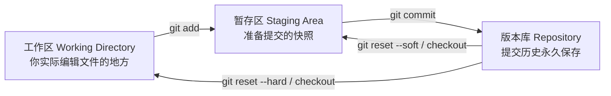
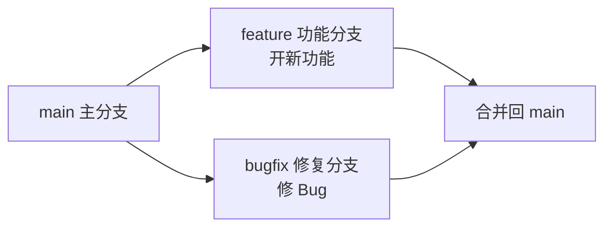

> 面向零基础起步，梳理 Git 的核心概念、常用命令与协作流程，帮助你在实际开发中顺利上手版本管理。本笔记以命令行操作为主，掌握了命令行，图形工具（VSCode、SourceTree、IDE 内置）都能很快上手。

## 一、Git 是什么

**Git** 是一个**分布式版本控制系统**，由 Linux 之父林纳斯·托瓦兹（Linus Torvalds）于 2005 年开发，用于高效地管理代码的每一次修改历史。

> 个人笔记：可以简单理解为"代码的后悔药 + 时光机"。你写的每一版代码都能被记录、对比、回退，多人协作时也能各改各的互不干扰，最后合并到一起。

### 1.1 版本控制解决了什么问题

| 没有版本控制 | 有了 Git |
| --- | --- |
| 手动复制 `项目最终版.zip`、`项目最终版2.zip` | 每次提交都自动留档，随时可回退 |
| 改坏了代码很难找回原样 | `git revert` / `git reset` 一键恢复 |
| 多人改同一个文件互相覆盖 | 分支并行开发，冲突可解决 |
| 不知道某行代码是谁、什么时候、为什么改的 | `git blame` / `git log` 全可追溯 |

### 1.2 集中式 vs 分布式

- **集中式（SVN）**：所有版本都存在中央服务器，断网、服务器挂了就完蛋。
- **分布式（Git）**：每个开发者本地都有一份**完整的历史副本**，断网也能提交、查看历史，服务器挂了也能从任意一个副本恢复。

### 1.3 Git 与 GitHub / Gitee 的关系

- **Git**：本地运行的版本控制工具（命令本身）。
- **GitHub / Gitee / GitLab**：基于 Git 的**代码托管平台**（云端仓库），用来存放、分享、协作你的代码。

```
Git（本地工具）  ←push/pull→  GitHub / Gitee（云端仓库）
```

---

<a id="sec2"></a>
## 二、安装与初始配置

### 2.1 安装 Git

- **Windows**：到官网 <https://git-scm.com/downloads> 下载安装包，一路"Next"即可。装完在开始菜单能看到 **Git Bash**（推荐使用，命令风格和 Linux 一致）。
- **macOS**：安装 Xcode Command Line Tools（`xcode-select --install`），或通过 Homebrew：`brew install git`。
- **Linux**：`sudo apt install git`（Debian/Ubuntu）或 `sudo dnf install git`（Fedora）。

安装后验证：

```bash
git --version
# 输出示例：git version 2.43.0
```

### 2.2 配置用户名和邮箱（必须）

提交记录会带上作者信息，**第一次使用前必须配置**（改的是全局配置，写一次终身有效）：

```bash
git config --global user.name "你的名字"
git config --global user.email "你的邮箱@example.com"
```

> 个人笔记：这里的邮箱建议和你 GitHub / Gitee 账号的邮箱一致，这样提交能正确关联到你的账号头像上。

### 2.3 其他常用配置

```bash
# 设置默认文本编辑器（Windows 用 VSCode 为例）
git config --global core.editor "code --wait"

# 设置默认分支名为 main（Git 新版本默认已是 main）
git config --global init.defaultBranch main

# 解决中文文件名显示为转义字符
git config --global core.quotepath false

# 查看所有配置
git config --list
```

---

<a id="sec3"></a>
## 三、核心概念：三个区域

理解 Git 最重要的模型：文件在 **工作区 → 暂存区 → 版本库** 之间流动。



| 区域 | 是什么 | 常用命令 |
| --- | --- | --- |
| 工作区 | 你硬盘上看得见、正在编辑的文件 | 直接改文件 |
| 暂存区（index） | 从工作区挑选出来、准备打包提交的改动 | `git add` |
| 版本库 | 已提交的历史记录，每个 commit 是一个完整快照 | `git commit` |

> 个人笔记：把"提交"想象成给文档拍快照。`git add` 是把选中的改动放进"待拍"的篮子，`git commit` 才是真正按下快门、存进相册。**Git 存的不是差异，而是每次提交的完整快照**（通过压缩和指针高效实现）。

---

<a id="sec4"></a>
## 四、首次提交：从零开始

### 4.1 初始化仓库

```bash
# 进入你的项目目录
cd /path/to/your-project

# 把当前目录变成 Git 仓库（只需一次）
git init
```

> 注意：不要在磁盘根目录或整个用户主目录执行 `git init`，应该只在**某个具体项目文件夹**里初始化。

### 4.2 查看状态

```bash
git status
```

它会告诉你：哪些文件被修改了、哪些还没提交。这是**使用频率最高**的命令，任何操作前后都可以看一眼。

### 4.3 添加并提交

```bash
# 把某个文件加入暂存区
git add README.md

# 把当前目录所有改动加入暂存区
git add .

# 提交（-m 后面写本次改动的说明）
git commit -m "初始化项目：添加 README"
```

> 个人笔记：提交说明要写"**这次改了什么、为什么改**"，而不是流水账。好的提交信息让几个月后的你（和同事）一眼看懂历史。

### 4.4 完整的最小流程示例

```bash
git init                       # 1. 初始化
git add .                      # 2. 全部加入暂存区
git commit -m "第一次提交"      # 3. 提交
git log --oneline              # 4. 查看历史：会看到一条提交记录
```

---

<a id="sec5"></a>
## 五、查看与比较：status / log / diff

### 5.1 查看提交历史

```bash
git log                 # 完整历史（按时间倒序）
git log --oneline       # 每行一条，简洁模式
git log --graph         # 图形化展示分支走向
git log --oneline --graph --all   # 最常用组合：看所有分支的树状历史
```

### 5.2 查看改动内容

```bash
git diff                # 工作区 vs 暂存区（还没 add 的改动）
git diff --staged       # 暂存区 vs 上次提交（已 add 未 commit 的改动）
git diff HEAD           # 工作区 vs 最近一次提交（全部未提交改动）
```

> 个人笔记：提交之前养成 `git diff` 的习惯，先看看自己到底改了啥，避免把调试代码、临时打印误提交上去。

### 5.3 查看某行代码是谁改的

```bash
git blame 文件名.py      # 逐行显示：谁、什么时候、哪次提交改的
```

---

<a id="sec6"></a>
## 六、撤销与回退

撤销是新手最容易懵的部分，核心口诀：**改错了用 restore，提交错了用 reset，已推送用 revert**。

### 6.1 撤销工作区的修改（还没 add）

```bash
git restore 文件名       # 丢弃工作区改动，回到最近一次提交的状态
```

### 6.2 撤销暂存（已经 add，还没 commit）

```bash
git restore --staged 文件名    # 把文件移出暂存区，但保留工作区改动
```

### 6.3 回退提交（已经 commit，还没推送）

`git reset` 有三个模式，区别在于回退时**是否保留改动**：

| 命令 | 保留工作区改动 | 保留暂存区改动 | 场景 |
| --- | --- | --- | --- |
| `git reset --soft HEAD~1` | 保留 | 保留 | 想重新编辑提交信息 / 把多次提交合并 |
| `git reset --mixed HEAD~1`（默认） | 保留 | 不保留 | 想重新 add 后再提交 |
| `git reset --hard HEAD~1` | 不保留 | 不保留 | 彻底丢弃最近一次提交及其改动（**危险**） |

```bash
# 回退最近 1 次提交（改动保留在暂存区）
git reset --soft HEAD~1

# 回退到任意一次提交（用 git log 查看 commit 哈希）
git reset --hard 9f3a2b1
```

> ⚠️ 警告：`--hard` 会**永久删除**未提交的改动，执行前务必确认。已经 `push` 到远程的提交**不要用 reset 回退**（会导致历史分叉），改用下面的 `revert`。

### 6.4 安全撤销已推送的提交

```bash
git revert 提交哈希      # 生成一次"反向提交"，把改动撤销但保留历史
git revert HEAD         # 撤销最近一次提交
```

> 个人笔记：`reset` 是"时光倒流"（改写历史），`revert` 是"新增一条修正记录"（不篡改历史）。团队协作时，远程分支上**永远用 revert**，自己本地随便 reset。

---

<a id="sec7"></a>
## 七、分支管理

分支是 Git 最强大的功能：每个分支是一条独立的开发线，互不干扰，最后再合并。



### 7.1 分支的增删查

```bash
git branch                 # 查看所有本地分支（* 表示当前所在分支）
git branch 分支名          # 创建分支
git switch 分支名          # 切换分支（旧命令：git checkout 分支名）
git switch -c 新分支名     # 创建并切换到新分支（旧命令：git checkout -b）
git branch -d 分支名       # 删除已合并的分支
git branch -D 分支名       # 强制删除未合并的分支（危险）
```

> 个人笔记：`git switch` 是新版推荐命令，语义比 `checkout` 清晰（checkout 还兼职恢复文件，容易混淆）。Git 2.23+ 都支持。

### 7.2 合并分支

```bash
# 先切回要"接收改动"的分支（通常是 main）
git switch main

# 把 feature 分支合并进来
git merge feature
```

### 7.3 冲突与解决

当两个分支**修改了同一个文件的同一段内容**时，合并会产生冲突。此时 Git 会在文件里标注：

```
<<<<<<< HEAD
main 分支上的内容
=======
feature 分支上的内容
>>>>>>> feature
```

解决步骤：

1. 打开冲突文件，手动决定保留哪部分（或都保留），删掉 `<<<<<<<`、`=======`、`>>>>>>>` 标记行；
2. 保存文件后：
```bash
git add 冲突文件
git commit -m "解决 feature 合并冲突"
```

> 个人笔记：冲突不是灾难，是正常的协作现象。谁改的模块冲突多，通常说明模块边界划分不够清晰——这是重构的信号。

### 7.4 merge 与 rebase 的区别（了解即可）

| | merge | rebase |
| --- | --- | --- |
| 历史 | 保留分支合并点，历史呈树状分叉 | 把提交"移植"到另一条分支顶端，历史呈直线 |
| 优点 | 安全、不改写历史 | 历史干净、线性易读 |
| 缺点 | 历史分叉、稍显杂乱 | 改写提交哈希，**禁止对已推送分支使用** |

个人建议：本地分支整理可以用 `rebase`；团队共享分支一律 `merge`。

---

<a id="sec8"></a>
## 八、远程仓库与团队协作

### 8.1 关联远程仓库

```bash
# 查看远程仓库
git remote -v

# 关联远程仓库（origin 是远程仓库的默认名字）
git remote add origin https://github.com/你的用户名/仓库名.git
```

### 8.2 克隆已有仓库

```bash
git clone https://github.com/你的用户名/仓库名.git
# 克隆到当前目录，自动关联远程，无需手动 add remote
```

### 8.3 推送与拉取

```bash
git push                 # 把本地提交推送到远程（首次用 git push -u origin main）
git pull                 # 拉取远程最新改动并合并（等于 fetch + merge）
git fetch                # 只拉取远程改动信息，不自动合并
```

- `git push -u origin main`：首次推送并建立关联，之后直接 `git push` 即可。
- 推送前先 `git pull`，把远程的新改动合并进来，能减少冲突。

### 8.4 完整协作流程（常用）

```bash
git switch main          # 1. 切回主分支
git pull                 # 2. 拉取最新代码
git switch -c feature-login   # 3. 新建功能分支
# ……开发、add、commit 若干次……
git push -u origin feature-login   # 4. 推送功能分支
# 5. 到 GitHub / Gitee 上发起 Pull Request（PR）/ 合并请求（MR）
# 6. 审核通过后合并到 main
```

> 个人笔记：团队协作的铁律——**不要在 main 上直接开发**。每个需求开一个分支，完成后通过 PR/MR 审核合并，这样 main 永远保持可发布状态。

### 8.5 推送被拒绝怎么办

```bash
# 原因：远程有本地没有的提交
git pull --rebase        # 先把本地提交"垫"到远程最新代码之上，再 push
git push
```

> 不要用 `git push --force` 覆盖远程历史（除非你清楚自己在做什么且是唯一开发者）。`--force-with-lease` 比 `--force` 安全，但也要慎用。

---

<a id="sec9"></a>
## 九、日常开发工作流

把前面的命令串成一个完整的日常循环：

```bash
# 早上开始干活
git switch main && git pull          # 同步最新代码
git switch -c feature-xxx            # 开新分支

# 写代码过程中：反复执行"查看 → 暂存 → 提交"
git status                            # 看改了什么
git add 相关文件                      # 精准暂存（比 git add . 更可控）
git commit -m "实现 xxx 功能"         # 小步提交

# 下班前
git push -u origin feature-xxx       # 推送分支，准备提 PR
```

### 小步提交原则

- 每次提交只做**一件事**（一个功能点、一个修复）；
- 提交信息用动词开头：`实现`、`修复`、`重构`、`优化`、`添加`；
- 宁可提交 10 次小的，不要 1 次大的——回退时更灵活。

---

<a id="sec10"></a>
## 十、实用技巧与配置

### 10.1 .gitignore：忽略不需要跟踪的文件

在项目根目录创建 `.gitignore` 文件，写入手动忽略规则：

```
# 编译产物
node_modules/
dist/
*.pyc

# 环境配置（含密钥，千万别提交！）
.env
*.local

# 系统文件
.DS_Store
Thumbs.db
```

> ⚠️ 密钥、密码、token **永远不要**提交到 Git 仓库，一旦推送出去就视为泄露，要立刻作废重发。

### 10.2 临时保存现场：git stash

```bash
git stash            # 把未提交的改动临时收起来，工作区变干净
git stash list       # 查看所有 stash
git stash pop        # 恢复最近一次 stash 并删除它
git stash apply      # 恢复但不删除
```

场景：写到一半要紧急切分支改 Bug，又不想提交半成品——`git stash` 正合适。

### 10.3 打标签：git tag

```bash
git tag v1.0.0               # 给当前提交打标签
git tag -a v1.0.0 -m "发布 1.0.0"   # 带说明的标签
git push origin v1.0.0       # 推送标签
git tag                      # 查看所有标签
```

一般用于标记发布版本：`v1.0.0`、`v2.1.3`。

### 10.4 常用别名

```bash
git config --global alias.st status
git config --global alias.co checkout
git config --global alias.lg "log --oneline --graph --all"
```

之后 `git st`、`git co`、`git lg` 就能用了。

### 10.5 查看帮助

```bash
git help 命令名      # 例如 git help log
git 命令名 --help
```

---

<a id="sec11"></a>
## 十一、常见问题排查

| 现象 | 原因 | 解决办法 |
| --- | --- | --- |
| `git commit` 报错说没有 user.name/email | 没配置身份 | 执行 2.2 的 `git config --global` |
| `git push` 被拒绝（non-fast-forward） | 远程有新提交 | `git pull --rebase` 再 `git push` |
| 文件明明改了但 `git status` 没显示 | 文件被 .gitignore 忽略 | 检查 .gitignore，用 `git status --ignored` 查看 |
| 提交错了想改说明 | — | `git commit --amend`（仅限未推送的最近一次） |
| 合并冲突不知道改哪部分 | 双方改了同一处 | 按 7.3 手动解决 |
| 想找回误删的分支 | — | `git reflog` 找到哈希，`git branch 分支名 哈希` 重建 |
| 提交了不该提交的大文件 | — | `git rm --cached 文件名` 停止跟踪（历史清理需 filter-repo，较复杂） |
| 中文文件名乱码 | Windows 编码问题 | `git config --global core.quotepath false` |

> 万能救命命令：**`git reflog`**。Git 会记录所有分支指针的移动历史，即使 `reset --hard` 误操作、分支误删，只要 reflog 里还有记录就能找回。

---

<a id="sec12"></a>
## 十二、学习资源

- **官方文档**：<https://git-scm.com/doc>（含 Pro Git 中文版免费电子书）
- **Pro Git 中文版**：<https://git-scm.com/book/zh/v2>（最权威的完整教程）
- **交互式练习**：<https://learngitbranching.js.org>（可视化练分支，强烈推荐）
- **Git 官网下载**：<https://git-scm.com/downloads>
- **GitHub 官方文档**：<https://docs.github.com/zh>

### 建议的学习路线

1. 先装好 Git，把第二、四章的配置和首次提交走一遍；
2. 用 **learngitbranching** 练熟分支和合并（第七章）；
3. 找一个本地小项目，坚持每天用 Git 提交，养成习惯；
4. 注册 GitHub，学会 clone / push / pull，体验一次真实的 PR 协作；
5. 遇到问题先 `git status` 看状态，再查报错信息，最后用官方文档。

> 个人笔记：Git 的命令有几十个，但日常工作 90% 的时间只用 `status`、`add`、`commit`、`push`、`pull`、`log` 这六个。先把这六个用熟，其余遇到再查，完全够用。**用起来，才是学会的唯一方式。**
