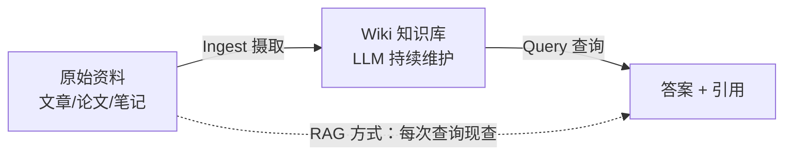
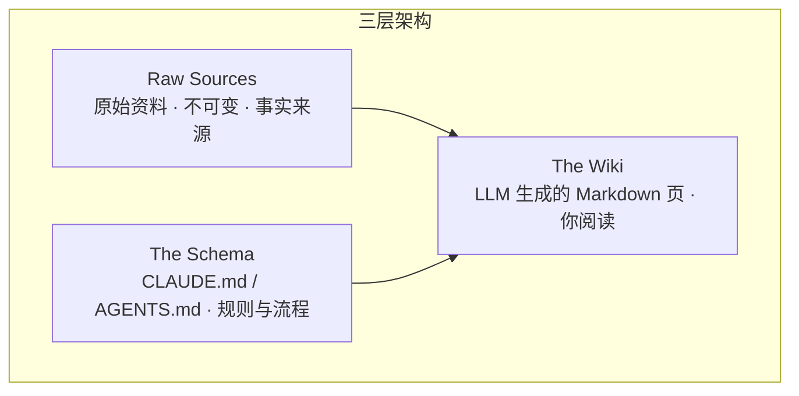

> 面向想用 AI 系统化管理自己知识的人，介绍 Andrej Karpathy 于 2026 年提出的 **LLM Wiki** 模式：不是让 AI 在问答时临时翻资料（RAG），而是让 AI **持续构建、维护一份互相关联的个人知识库 Wiki**。本指南覆盖核心思想、三层架构、操作方法、现成工具与上手步骤。

## 目录

- [一、LLM Wiki 是什么](#sec1)
- [二、与 RAG 的本质区别](#sec2)
- [三、三层架构](#sec3)
- [四、三个核心操作：Ingest / Query / Lint](#sec4)
- [五、索引与日志：index.md 和 log.md](#sec5)
- [六、目录结构与页面长什么样](#sec6)
- [七、工具生态](#sec7)
- [八、快速上手](#sec8)
- [九、最佳实践与技巧](#sec9)
- [十、适用场景与局限](#sec10)
- [十一、学习资源](#sec11)

---

<a id="sec1"></a>
## 一、LLM Wiki 是什么

**LLM Wiki** 是一种"用大模型构建和维护个人知识库"的模式，由 AI 领域知名研究者 **Andrej Karpathy** 于 2026 年 4 月以 idea 文件形式提出（GitHub Gist，star 5000+）。核心思想：

> 与其像 RAG 那样在提问时从原始文档临时检索拼装答案，不如让 LLM **增量地构建并维护一份持久的 Wiki**——一组结构化的、互相链接的 Markdown 文件，横亘在你和原始资料之间。



> 个人笔记：Karpathy 的原话是——"Obsidian 是 IDE，LLM 是程序员，wiki 是代码库"。你负责找资料、提问、思考方向；LLM 负责所有"苦力活"：总结、交叉引用、归档、记账。

### 1.1 它解决什么问题

大多数人和 LLM 协作的方式是 RAG：传一堆文件上去，提问时 LLM 检索相关片段回答。问题是：

- **没有积累**：每次提问，模型都要从零重新拼装知识；
- **没有沉淀**：问过的好问题、得出的好结论，聊完就消失了；
- **没有维护**：知识的交叉引用、新旧矛盾、综合理解，从未被系统整理。

LLM Wiki 的关键差异：**wiki 是一个持久、复利增长的工件（compounding artifact）**——交叉引用已经建好，矛盾已被标记，综合理解已经反映你读过的所有内容。每加入一份资料、每提出一个问题，wiki 都会变得更丰富。

---

<a id="sec2"></a>
## 二、与 RAG 的本质区别

| 对比项 | 传统 RAG | LLM Wiki |
| --- | --- | --- |
| 知识组织时机 | 查询时临时检索 | **摄取时预先整理** |
| 知识形态 | 切块向量 + 原文 | 结构化、互链的 Markdown 页面 |
| 是否积累 | 否，每次重新发现 | **是，持续复利增长** |
| 交叉引用 | 无 | 页面间天然互联 |
| 矛盾处理 | 不感知 | 摄取时主动标记新旧矛盾 |
| 回答综合能力 | 每次临时拼装 | 综合已沉淀在 wiki 中 |
| 产物 | 只有问答输出 | **一份可读、可浏览的知识库文档** |
| 维护成本 | 低（无维护） | 靠 LLM 自动化维护（近乎零人工） |

> 关键认知：RAG 是"临时查资料"，LLM Wiki 是"把资料编译成知识库"。前者适合快速问答，后者适合**长期积累型学习**——读一本书、做一个研究、经营一个团队的知识库。

---

<a id="sec3"></a>
## 三、三层架构

LLM Wiki 把一切分成三层，各司其职：

### 3.1 Raw Sources（原始资料层）

- 你精选的源文档集合：文章、论文、图片、数据文件；
- **不可变（immutable）**：LLM 只读，永不修改；
- 它是知识的**事实来源（source of truth）**。

### 3.2 The Wiki（Wiki 层）

- 一个由 LLM 生成的 Markdown 文件目录：摘要页、实体页、概念页、对比表、总览、综合；
- **LLM 完全拥有这一层**：创建页面、资料更新时维护、保持交叉引用一致；
- 你只负责读它、浏览它。

### 3.3 The Schema（模式层）

- 一个配置文件（如 Claude Code 的 `CLAUDE.md`、Codex 的 `AGENTS.md`）；
- 告诉 LLM：wiki 如何组织、有哪些约定、摄取/问答/维护分别按什么流程执行；
- **这是让 LLM 从"通用聊天机器人"变成"守纪律的 wiki 管理员"的关键**；
- 你和 LLM 一起在实践中持续演化这份配置。



> 个人笔记：把三者类比代码工程——原始资料是"上游数据"，wiki 是"编译产物"，schema 是"构建脚本"。上游数据只读，产物由构建自动生成，脚本决定怎么生成。

---

<a id="sec4"></a>
## 四、三个核心操作：Ingest / Query / Lint

### 4.1 Ingest（摄取）：喂入新资料

把一份新资料丢进 raw 目录，让 LLM 处理。典型流程：


- 一份资料可能触及 **10-15 个 wiki 页面**（新增 + 更新）；
- 建议**一次只摄取一份**，人保持参与：读摘要、检查更新、指导 LLM 强调什么；
- 也可以批量摄取，但监督会更少，质量需要自己权衡。

### 4.2 Query（查询）：向 wiki 提问

- LLM 先搜索相关页面，读取，综合答案并**给出引用**；
- 答案可以是多种形态：Markdown 页面、对比表格、幻灯片（Marp）、图表（matplotlib）、画布（canvas）；
- **重要洞见：好答案可以归档回 wiki 成为新页面**——一次对比分析、一个发现的连接，不应消失在聊天记录里。这样你的探索也像摄取资料一样复利沉淀。

### 4.3 Lint（健康检查）：周期性体检

让 LLM 定期给 wiki 做"体检"，检查：

| 检查项 | 说明 |
| --- | --- |
| 页面间矛盾 | 新旧资料冲突的声明 |
| 过时声明 | 被新资料取代的旧结论 |
| 孤儿页面 | 没有任何入链的页面 |
| 缺失页面 | 被反复提及但没有独立页面的概念 |
| 缺失交叉引用 | 相关页面之间没建链接 |
| 数据缺口 | 可以靠网络搜索补上的空白 |

> 个人笔记：Lint 是 LLM Wiki 长期健康的保障——人会厌倦维护，LLM 不会。定期让它"找毛病"，还能顺带让它**建议新的研究问题和资料来源**。

---

<a id="sec5"></a>
## 五、索引与日志：index.md 和 log.md

两个特殊文件帮 LLM（和你）在 wiki 变大后导航：

### 5.1 index.md（内容目录）

- **内容导向**的目录：每个页面列出链接 + 一行摘要 + 元数据（日期、来源数）；
- 按类别组织：实体（entities）、概念（concepts）、来源（sources）等；
- **每次 Ingest 都更新**；
- 查询时 LLM **先读 index 找到相关页面，再深入钻取**——这种模式在中等规模（约 100 个来源、几百个页面）下表现很好，**甚至不需要向量检索基础设施**。

### 5.2 log.md（时间日志）

- **按时间顺序**的追加式记录：每次 ingest、query、lint 都记一条；
- 统一前缀让日志可被命令行解析：

```text
## [2026-04-02] ingest | Article Title
## [2026-04-03] query  | What is the evidence for X?
```

```bash
grep "^## " log.md | tail -5   # 查看最近 5 条记录
```

- 给 wiki 提供演化时间线，也帮 LLM 了解"最近做过什么"。

---

<a id="sec6"></a>
## 六、目录结构与页面长什么样

一个典型的 LLM Wiki 目录（以开源项目 llmwiki 为例）：

```text
~/research/                  # 你的原始资料文件夹（不被改动）
├── papers/
│   └── attention.pdf
├── notes.md
└── data.xlsx

wiki/                        # LLM 生成的页面
├── overview.md              # 总览
└── concepts/
    ├── attention.md         # 概念页
    └── transformer.md

.llmwiki/                    # 隐藏的派生层：索引 + 缓存（可删除重建）
├── index.db                 # SQLite 本地搜索索引
└── cache/
```

页面通常带 YAML frontmatter（标签、日期、来源数），供 Obsidian 的 Dataview 插件做动态查询：

```markdown
---
tags: [llm, attention]
sources: 5
created: 2026-04-02
---

# Attention Mechanism

## 摘要
...

## 相关概念
- [[Transformer]]
- [[Self-Attention]]

## 来源
- [1] Attention Is All You Need
```

> 关键点：**wiki 就是普通 Markdown 文件的 git 仓库**——自带版本历史、分支、协作能力；任何编辑器都能打开，人可以随时手动修改。

---

<a id="sec7"></a>
## 七、工具生态

LLM Wiki 是"模式"而非"某个软件"，生态正在快速生长：

| 工具/项目 | 定位 |
| --- | --- |
| **Karpathy 原始 idea 文件** | 模式定义本身，可直接复制给任何 Agent 使用 |
| **llmwiki**（lucasastorian/llmwiki） | 最完整的开源实现：Web 应用 + Chrome 插件 + MCP + 夜间自动维护 |
| **awesome-llm-wiki**（gavischneider） | 实现、文章、视频、论文的策展清单 |
| **llm-wiki-memory-template**（crcresearch） | 模板化实现，含一键引导脚本 |
| **qmd** | 本地 Markdown 搜索引擎（混合 BM25/向量 + LLM 重排），CLI + MCP，wiki 变大后的检索方案 |
| **LLMWiki**（suwonlee） | 本地优先的编码 Agent 工作区实现 |
| **project-wiki**（giodra96） | 针对代码库的扩展：规范 ↔ ADR ↔ 源码双向可追溯 |

### 配套 Obsidian 插件

| 插件 | 用途 |
| --- | --- |
| **Web Clipper** | 浏览器扩展，一键把网页文章转成 Markdown 抓进 raw 目录 |
| **Graph View** | 查看 wiki 的形态：什么连着什么、哪些是枢纽页、哪些是孤儿页 |
| **Dataview** | 基于 frontmatter 做动态表格和列表查询 |
| **Marp** | 直接用 wiki 内容生成幻灯片 |

---

<a id="sec8"></a>
## 八、快速上手

### 方案 A：用现成项目 llmwiki（推荐先体验）

```powershell
# 1. 安装（需 Python 3.11+、Node.js 20+）
git clone https://github.com/lucasastorian/llmwiki.git
cd llmwiki
python -m venv .venv
.venv\Scripts\Activate.ps1          # 若被策略拦截，先执行 Set-ExecutionPolicy -Scope CurrentUser RemoteSigned
pip install -r api/requirements.txt -r mcp/requirements.txt
cd web; npm install; cd ..

# 2. 指向你的资料文件夹（不会改动、上传你的文件）
python llmwiki open C:\Users\you\research
# 自动初始化、建索引、启动本地服务，浏览器打开 localhost:3000

# 3. 让 Claude 能读写 wiki（MCP 连接）
python llmwiki mcp-config C:\Users\you\research
# 把输出的 JSON 粘贴进 claude_desktop_config.json 或 .claude/settings.json

# 4. 告诉 Claude："Read the guide, then ingest my sources and start building the wiki."
```

进阶：设置 **Claude Routine（定时任务）**，让它每晚自动处理新增资料、更新受影响的页面——wiki 自动保持最新。

### 方案 B：DIY（Karpathy 原始模式，最灵活）

1. 建三个目录：`raw/`（原始资料）、`wiki/`（知识库）、根目录放 `CLAUDE.md`（schema）；
2. 把 LLM Wiki 的 idea 文件内容贴给 Claude Code / Codex，让它理解模式；
3. 在 `CLAUDE.md` 中写清楚：页面命名规范、frontmatter 字段、ingest 流程、index/log 维护规则；
4. 日常：往 `raw/` 丢资料 → 让 Agent"ingest 最新资料" → 在 Obsidian 里浏览更新结果；
5. 定期："lint 一下 wiki" → 让它汇报矛盾、孤儿页、缺口。

> 个人建议：先跑一遍方案 A 体验完整闭环，再根据自己的习惯用方案 B 定制。核心永远是那三件事——**raw 只读、wiki 全交给 LLM、schema 持续演化**。

---

<a id="sec9"></a>
## 九、最佳实践与技巧

| 实践 | 说明 |
| --- | --- |
| **一次摄取一个源** | 保持人参与，指导 LLM 强调重点，质量更高 |
| **好答案归档回 wiki** | 对比分析、新连接、结论——存成新页面，让探索也复利 |
| **定期 Lint** | 每周让 LLM 体检一次：矛盾、孤儿页、缺失链接 |
| **用 Web Clipper 抓资料** | 阅读时顺手 clip，raw 目录持续增长 |
| **图片本地化** | Obsidian 设置附件目录为 `raw/assets/`，绑定快捷键下载图片，避免外链失效 |
| **Graph View 看形态** | 每周看一次关系图：哪些是枢纽、哪些是孤儿 |
| **wiki 用 git 管理** | 白嫖版本历史，随时回退 LLM 的误操作 |
| **schema 持续演化** | 用着不顺就改 CLAUDE.md，让规则贴合你的领域 |

### 注意一个常见坑：陈旧状态复制

社区实践（WadeGIMPBC）总结的规则：**笔记记录"事物的形状"，不记录"事物的当前值"**——会变化的值（同步哈希、日期、计数）不要写死在正文里，放在 frontmatter 或让工具实时读取；否则会在无人察觉时静默过时。写死计数会"三周后从五条变六条时仍写着五条"。

---

<a id="sec10"></a>
## 十、适用场景与局限

### 10.1 典型适用场景

| 场景 | 用法 |
| --- | --- |
| 个人学习 | 读文章、听播客、记日记，构建"自我认知"的结构化画像 |
| 深度研究 | 几周/几月钻研一个主题：读论文、攒资料、演化论点 |
| 读书 | 每章归档，建人物/主题/情节线页面，读完整本书得到一份"私人粉丝维基" |
| 团队/企业 | Slack 线程、会议记录、项目文档喂进去，AI 维护内部知识库 |
| 竞争分析、尽调、课程笔记 | 一切"随时间积累、需要组织"的知识 |

### 10.2 局限与注意

| 局限 | 说明 | 应对 |
| --- | --- | --- |
| **成本** | 每次 ingest 要读全文 + 更新多页，比 RAG 贵（社区实测查询侧约 21x，启用缓存可大幅降低） | 用小模型做维护、开启 prompt caching、控制频率 |
| **实体查询偏弱** | 社区实测：主题类问题 wiki 占优（71%），但"查某人/某实体"类查询向量 RAG 更好（10%） | 按查询类型路由：主题问题走 wiki，实体查询走 RAG |
| **幻觉被固化** | 若摄取时理解有误，错误会写进 wiki 页面并持续引用 | 保留来源引用、定期 lint、关键内容人审 |
| **启动成本** | 需要配置 schema、建立习惯 | 从方案 A 开始，逐步演化 |
| **不是全自动** | 资料策展、方向把控仍需人 | 定位就是"人定方向，AI 做簿记" |

> 个人笔记：LLM Wiki 和 RAG 不是二选一——实践中**可以共存**：wiki 沉淀长期积累的主题知识，RAG 处理快速、临时的检索需求。别神化也别轻视，按查询类型选路即可。

---

<a id="sec11"></a>
## 十一、学习资源

- **原始 idea 文件**（必读）：<https://gist.github.com/karpathy/442a6bf555914893e9891c11519de94f>（Karpathy 的 LLM Wiki，含完整注释讨论）
- **llmwiki 开源实现**：<https://github.com/lucasastorian/llmwiki>
- **awesome-llm-wiki 清单**：<https://github.com/gavischneider/awesome-llm-wiki>
- **llm-wiki-memory-template**：<https://github.com/crcresearch/llm-wiki-memory-template>
- **精神祖先**：Vannevar Bush《As We May Think》(1945)——Memex 个人知识库构想

### 建议的学习路线

1. 先读 Karpathy 原始 idea 文件，理解模式而非工具；
2. 用 llmwiki 跑通一个最小闭环：建库 → 丢 3-5 份资料 → 看 wiki 页 → 提问 → lint；
3. 观察 LLM 生成了什么页面，思考"如果我来定制 schema，要改什么"；
4. 搭 DIY 方案（raw/wiki/CLAUDE.md 三件套），用 Obsidian 浏览；
5. 坚持 2-4 周，让 wiki 积累到一定规模，再定期 lint 优化；
6. 进阶：接入 qmd 搜索、Marp 出幻灯片、尝试团队知识库场景。

> 个人笔记：LLM Wiki 最有价值的地方不在技术，而在**改变知识管理的习惯**——把"收藏了=学到了"变成"持续构建、持续沉淀"。它让知识库的维护成本趋近于零，而维护成本恰恰是人类放弃知识库的根本原因。
