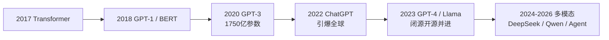
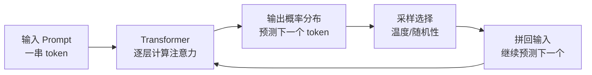
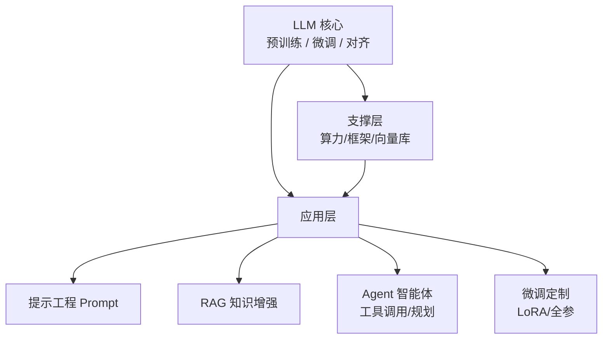

> 面向希望系统了解大语言模型（LLM）的学习者，以"百科词条"的方式，把 LLM 的定义、原理、发展、模型谱系、能力与生态一网打尽。适合作为 AI 知识库的"总纲"，与其他笔记（AI 基础、RAG、OCR 等）互相补充。

## 一、LLM 是什么

**大语言模型**（Large Language Model，简称 **LLM**）是一种基于 Transformer 架构、在海量文本上训练、参数量通常达数十亿甚至万亿级的深度学习模型，核心能力是**理解并生成自然语言**。

> 个人笔记：可以理解为"读完了半个互联网的超级语言模型"。它的训练目标看似简单——预测下一个词——但规模足够大之后，竟然学会了理解语义、推理、写代码等复杂能力，这就是所谓"量变引起质变"。

### 1.1 定义要点

| 特征 | 说明 |
| --- | --- |
| 架构 | 绝大部分基于 **Transformer**（自注意力机制） |
| 训练方式 | 自监督学习，在海量**无标注文本**上预测下一个 token |
| 规模 | 参数量数十亿起步，顶级模型达万亿级（如 GPT-4 传闻 1.8 万亿） |
| 能力 | 对话、翻译、摘要、问答、写作、代码生成等通用任务 |
| 地位 | 属于"基础模型（Foundation Model）"，是生成式 AI 的核心引擎 |

> 参考定义："一种基于 Transformer 神经网络的 AI 系统，参数量从数十亿到数万亿，在海量文本语料上训练以预测序列中的下一个 token，并借此学会理解和生成人类语言"（AI Wiki）。"在 Transformer 架构上构建的基础模型，通过训练数据集学习语言的统计模式"（Agentica Wiki）。

### 1.2 与普通语言模型的区别

| 对比项 | 传统语言模型 | LLM |
| --- | --- | --- |
| 参数量 | 百万级 | 十亿级以上 |
| 训练数据 | 领域小语料 | 全网级海量文本 |
| 能力 | 单一任务（如分词、标注） | 通才，多任务泛化 |
| 是否涌现 | 否 | 是（出现小模型没有的能力） |

---

## 二、发展简史

| 时间 | 事件 | 意义 |
| --- | --- | --- |
| 2017 | Google 发表 *Attention Is All You Need* | **Transformer 架构诞生**，LLM 的地基 |
| 2018 | OpenAI 发布 GPT-1；Google 发布 BERT | 预训练 + 微调范式确立 |
| 2019 | GPT-2 发布 | 展示大模型生成能力，轰动学界 |
| 2020 | GPT-3（1750 亿参数）发布 | "大力出奇迹"，规模定律得到验证 |
| 2021-2022 | InstructGPT、ChatGPT（2022.11）发布 | **对话式 AI 引爆大众**，AI 走进日常 |
| 2023 | GPT-4 发布；Meta 开源 Llama 系列 | 能力再跃升；**开源模型浪潮**开启 |
| 2024-2026 | DeepSeek、Qwen、GLM 等开源模型崛起；多模态、Agent 普及 | 中国开源模型跻身第一梯队；AI 从"聊天"走向"干活" |

> 个人笔记：LLM 的关键节点其实只有三个——**Transformer（架构）→ 规模（GPT-3）→ 对齐（ChatGPT）**。理解这三次跃迁，就理解了 LLM 的整个故事。

---

## 三、核心原理

### 3.1 Transformer 与注意力机制

- **Transformer**：完全基于注意力机制的网络结构，替代了 RNN/LSTM，可以**并行计算**、捕捉长距离依赖。
- **注意力（Attention）**：让模型在处理每个词时，"关注"句中其他相关词——这就是它理解"他/她"指代谁、上下文含义的能力来源。
- **预训练（Pretraining）**：在大规模文本上自监督学习（预测下一个词），学语言规律；
- **微调 / 对齐（Fine-tuning / Alignment）**：再用指令数据、人类反馈（RLHF）让模型"听话、有用、安全"。

### 3.2 模型是怎么"回答"的

- 输入输出都切成 **token**（词元，中文约一个字 ≈ 1-2 个 token）；
- 模型实际做的是**逐词预测**：根据已有内容预测最可能的下一个词，再拼回去继续预测；
- 所以 LLM 本质是"**高级的续写机器**"——但它续写得太好，好到像在思考。

### 3.3 规模定律（Scaling Law）

- 模型参数、数据量、算力**同步增大**时，性能会按可预测的规律稳定提升（Kaplan 2020）；
- 2022 年 Chinchilla 提出：**数据和参数要按比例增长**，多数模型其实是"数据欠拟合"的；
- 这也是各家疯狂堆参数、堆数据、堆 GPU 的根本原因。

### 3.4 涌现能力（Emergent Abilities）

当规模超过某个阈值，模型会出现小模型没有的能力：上下文学习（few-shot）、思维链推理（CoT）、代码生成等——这是 LLM 最神奇也最受争议的特性之一。

---

## 四、关键术语表

| 术语 | 含义 |
| --- | --- |
| **Token** | 文本的最小处理单元，中文约 1 字≈1-2 token；计费和上下文窗口都按它算 |
| **上下文窗口（Context Window）** | 模型一次能"看到"的 token 上限，如 128K、1M |
| **参数（Parameter）** | 模型内部的权重，规模越大容量越大 |
| **温度（Temperature）** | 控制随机性：低=确定/保守，高=发散/有创意 |
| **幻觉（Hallucination）** | 模型一本正经地编造不存在的内容 |
| **预训练（Pretrain）** | 在海量文本上学习语言规律，是"通识教育" |
| **微调（Fine-tuning）** | 用任务数据继续训练，是"岗前培训" |
| **对齐（Alignment）** | 让模型符合人类意图和价值观（如 RLHF） |
| **RLHF** | 基于人类反馈的强化学习，ChatGPT 成功的核心工程 |
| **LoRA** | 轻量微调技术，只训练少量参数，省算力 |
| **Prompt / 提示工程** | 通过精心设计输入来引导模型输出 |
| **Few-shot / In-context Learning** | 在输入里给几个示例，让模型学会新任务 |
| **RAG** | 检索增强生成，外挂知识库（见《RAG 深入浅出》） |
| **Agent（智能体）** | LLM + 工具 + 规划，能自主执行任务 |
| **多模态（Multimodal）** | 模型能处理文字、图像、音频、视频 |

---

## 五、主流模型谱系

### 5.1 闭源模型（API 服务）

| 厂商 | 代表模型 | 特点 |
| --- | --- | --- |
| OpenAI | GPT-4o、GPT-4.1、o 系列 | 综合能力标杆，生态最成熟 |
| Anthropic | Claude 系列 | 长文本、写作与安全口碑好 |
| Google | Gemini 系列 | 多模态、超长上下文 |
| 字节跳动 | 豆包（Doubao）系列 | 中文场景优秀，价格亲民 |
| 阿里 | 通义千问 Qwen | 中文能力突出 |
| 百度 | 文心一言 | 国内布局早，中文理解好 |
| DeepSeek | DeepSeek-V/R 系列 | 推理能力强，开源/API 性价比高 |

### 5.2 开源模型（可本地部署）

| 模型 | 特点 |
| --- | --- |
| **Llama 系列**（Meta） | 开源浪潮的开创者，生态最丰富 |
| **Qwen 系列**（阿里） | 中文最强开源阵营之一，覆盖 0.5B-72B+ |
| **DeepSeek** | 训练效率极高，推理模型表现出色 |
| **GLM 系列**（智谱） | 国内最早的开源大模型之一 |
| **Mistral** | 欧洲代表，小模型效率高 |
| **Gemma**（Google） | 轻量级开源补充 |

> 个人笔记：2024 年后开源模型与闭源模型的差距大幅缩小，中小团队做应用首选开源（Llama/Qwen/DeepSeek）+ 本地/私有化部署，成本可控且数据安全。

### 5.3 按参数规模分档

| 档位 | 规模 | 典型用途 |
| --- | --- | --- |
| 小模型 | 1B-7B | 端侧、手机、简单任务、微调底座 |
| 中模型 | 7B-70B | 企业应用主流，单卡/少卡可跑 |
| 大模型 | 100B+ | 顶级能力，需要多卡集群或 API 调用 |

---

## 六、能力与局限

### 6.1 强项

| 能力 | 例子 |
| --- | --- |
| 自然语言理解与生成 | 对话、写作、翻译、润色 |
| 代码生成与调试 | 写函数、解释报错、重构 |
| 知识问答 | 事实性问题、知识库结合（RAG） |
| 逻辑推理 | 数学、编程逻辑、思维链 |
| 内容结构化 | 摘要、提取、表格化、分类 |
| 多任务泛化 | 一个模型干所有活 |

### 6.2 局限

| 局限 | 说明 | 应对 |
| --- | --- | --- |
| **幻觉** | 编造事实，且非常自信 | RAG、要求标注来源、人工复核 |
| **知识截止** | 训练数据有时间上限 | RAG 接入最新资料、联网搜索 |
| **上下文限制** | 超长文本会"遗忘"中间内容 | 分块、摘要、分层检索 |
| **数学/精确计算弱** | 大数运算、多步推理易错 | 接计算器、代码解释器 |
| **缺乏实时感知** | 不知道当前时间、天气等 | 工具调用（Tool Use） |
| **安全与偏见** | 可能输出有害、歧视内容 | 对齐训练、内容审核 |

> ⚠️ 关键认知：LLM 是"预测下一个词"的模型，**不是数据库，也不是搜索引擎**。它不"知道"答案，而是"生成"最像答案的内容——这正是幻觉的根源，也是理解一切 LLM 应用设计的前提。

---

## 七、应用场景

| 场景 | 典型产品/形态 |
| --- | --- |
| 对话助手 | ChatGPT、豆包、Claude，通用聊天 |
| 知识问答 | 企业知识库问答（RAG）、文档问答 |
| 写作创作 | 公文、营销文案、小说、翻译 |
| 编程助手 | GitHub Copilot、Cursor、通义灵码 |
| 办公效率 | 会议纪要、邮件起草、表格处理 |
| 智能客服 | 电商、银行、政务客服机器人 |
| AI Agent | 自主规划 + 调用工具完成任务 |
| 多模态应用 | 图片理解、语音对话、视频生成 |
| 教育与学习 | 答疑、讲解、个性化学习助手 |

---

## 八、技术生态地图

围绕 LLM 形成了完整技术栈：

| 层 | 技术/工具 | 干什么 |
| --- | --- | --- |
| 模型层 | GPT、Claude、Qwen、DeepSeek、Llama | 提供能力 |
| 编排层 | LangChain、LlamaIndex、Dify | 把模型串成应用 |
| 知识层 | RAG、向量数据库、Embedding | 给模型接上私有知识 |
| 智能体层 | Agent 框架、MCP、Tool Use | 让模型动手干活 |
| 部署层 | vLLM、Ollama、推理优化 | 把模型跑起来 |
| 评估层 | RAGAS、Benchmark、人工评测 | 衡量效果 |

---

## 九、评估：怎么衡量一个模型好不好

| 评估方式 | 说明 | 例子 |
| --- | --- | --- |
| 公开基准（Benchmark） | 标准化考题集 | MMLU（知识）、HumanEval（代码）、GSM8K（数学） |
| 竞技场排名（Arena） | 用户盲测投票 | LMArena（Chatbot Arena） |
| 领域评测 | 针对实际业务设计测试集 | 客服语料、文档问答准确率 |
| 综合维度 | 单独看某一项能力 | 幻觉率、长文本、推理、速度、成本 |

> 个人笔记：**排行榜 ≠ 你的场景**。选模型时用"你自己的 50 个真实问题"做盲测，比任何公开榜单都靠谱。同时要综合看**成本、速度、上下文、隐私**——性能只是其中一个维度。

---

## 十、附：另一种 "LLM Wiki"

"LLM Wiki" 还有一个 2026 年兴起的新含义（由 Andrej Karpathy 等提出）：

**用 LLM 自动构建个人/项目知识库（Wiki）**——把原始文档（PDF、代码、Markdown）扔进去，LLM 自动抽取实体、概念、关系，生成互相链接的百科页面，形成可检索、可问答、可持续更新的知识库。

| 对比 | 传统 RAG | LLM Wiki |
| --- | --- | --- |
| 知识组织 | 只存"切块向量"，不做整理 | 生成结构化页面 + 概念链接 |
| 回答方式 | 检索相关块拼给模型 | 模型先读索引再钻取相关页 |
| 输出物 | 只有问答 | 还有一份**可读的 wiki 文档** |
| 适合 | 快速问答 | 长期积累、知识梳理、Obsidian 化 |

> 相关项目：llm-wiki（GitHub）、llm-wiki-memory-template 等，核心思路是"把知识沉淀成人类和 AI 都能读的结构化笔记"。

> 个人笔记：如果你以后想把自己的学习笔记自动整理成知识图谱式的 wiki，这个方向很值得关注——它和我们现在这个 Obsidian 知识库的思路一脉相承。

---

## 十一、学习资源

- **论文基石**：《Attention Is All You Need》（2017）、Scaling Laws（2020）、Chinchilla（2022）
- **LLM 百科词条**：AI Wiki（aiwiki.ai）、HyperAI 超神经百科
- **模型与评测**：LMArena（竞技场）、OpenCompass（司南，国产评测）
- **课程**：吴恩达《ChatGPT Prompt Engineering for Developers》、李宏毅《机器学习》（含 LLM 章节）
- **中文资料**：哈工大《大语言模型综述》中文版、GitHub 上的 LLM 学习路线仓库
- **动手实践**：Ollama（本地跑开源模型）、Hugging Face（模型社区）、Dify（应用搭建）

### 建议的学习路线

1. 先读本笔记 + 《AI 基础》，建立整体概念；
2. 用 ChatGPT / 豆包日常使用 2 周，感受能力边界（哪里强、哪里会编）；
3. 学提示工程：让模型"说人话、干实事"；
4. 动手搭一个 RAG 问答（见《RAG 深入浅出》），理解知识增强；
5. 用 Ollama 本地跑一个小模型，了解部署与推理；
6. 进阶：了解 Agent、微调（LoRA）、评估体系，按需深入。

> 个人笔记：LLM 领域更新极快，但**底层框架很稳定**——架构、规模、对齐、生态这四件事理解透了，新模型层出不穷也不慌。学习时多动手、少追新，把 RAG、Agent、评估这三件事做扎实，就超过了大多数人。
