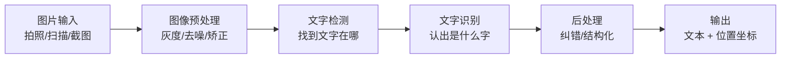

> 面向零基础起步，梳理 OCR（光学字符识别）的核心概念、技术原理、主流工具与上手方法，帮你理解"图片里的文字是怎么被电脑认出来的"，并学会用现成工具和代码快速落地。

## 目录

- [一、OCR 是什么](#sec1)
- [二、OCR 能做什么](#sec2)
- [三、工作原理：文字是怎么被认出来的](#sec3)
- [四、传统 OCR 与深度学习 OCR](#sec4)
- [五、主流 OCR 工具与引擎对比](#sec5)
- [六、快速上手：直接用现成工具](#sec6)
- [七、编程调用：Python 三行代码识别](#sec7)
- [八、进阶：识别效果不好怎么办](#sec8)
- [九、常见问题与局限性](#sec9)
- [十、学习资源](#sec10)

---

<a id="sec1"></a>
## 一、OCR 是什么

**OCR**（Optical Character Recognition，光学字符识别）是一种让计算机从图片、扫描件、拍照照片中**自动识别出文字**的技术。

> 个人笔记：可以理解为"电脑的看图识字"。你给它一张图，它输出里面包含的文字内容（包括文字在图片中的位置）。今天你手机上的"提取图中文字""拍照翻译""扫描文档转文字"，背后都是 OCR。

### 1.1 关键认知

- OCR **只负责"认字"**，输出的是文字内容和坐标位置；至于文字怎么用（翻译、搜索、编辑），是下游应用的事。
- OCR 不等于"图像里的文字能被搜索"。扫描版 PDF 之所以不能选中复制，是因为它只有图片、没有文字层，需要先 OCR 才有文字层。
- 中文识别的技术难度高于英文：汉字字符集大（常用 3500+ 字）、结构复杂（左右/上下/包围结构）、形近字多。

### 1.2 OCR 的完整链路



| 阶段 | 要解决的问题 | 打个比方 |
| --- | --- | --- |
| 图像预处理 | 图太暗、太歪、有噪点怎么办 | 先把纸擦干净、摆正 |
| 文字检测 | 文字在图片的哪些位置 | 先找到"哪里写着字" |
| 文字识别 | 每个字是什么 | 再逐字"认"出来 |
| 后处理 | 用上下文纠正错别字、按行排版 | 校对一遍、整理成段落 |

---

<a id="sec2"></a>
## 二、OCR 能做什么

| 场景 | 典型应用 | 例子 |
| --- | --- | --- |
| 文档数字化 | 纸质文件、扫描件转成可编辑文本 | 合同扫描、书籍电子化、档案归档 |
| 截图/图片提取文字 | 从图片中复制文字 | 微信"提取文字"、备忘录扫描、听课拍板书转笔记 |
| 证件识别 | 结构化提取证件信息 | 身份证、银行卡、营业执照、护照自动录入 |
| 票据识别 | 自动录入金额、日期、商户 | 发票报销、小票记账、快递单 |
| 车牌识别 | 交通场景自动识别车牌 | 停车场收费、违章抓拍 |
| 拍照翻译 | 识别 + 翻译一体 | 出国看菜单、看路牌 |
| 无障碍辅助 | 帮助视障人群"读"图 | 屏幕朗读图片文字 |
| 内容审核 | 检测图片里的违规文字 | 平台审核截图中的敏感信息 |

> 个人笔记：OCR 如今是很多 AI 应用的"地基"——比如把纸质表格拍下来自动录入 Excel、把聊天截图结构化存档，第一步都是 OCR。

---

<a id="sec3"></a>
## 三、工作原理：文字是怎么被认出来的

### 3.1 图像预处理

原始图片直接识别效果很差，先要做：

- **灰度化**：去掉颜色干扰，只保留明暗；
- **二值化**：把图变成"黑字白底"（或反之），突出文字；
- **去噪**：去掉灰尘、水印、摩尔纹等干扰；
- **倾斜矫正**：拍照歪了的图先转正；
- **透视矫正**：把拍变形的纸张拉回矩形。

### 3.2 文字检测：找到文字在哪

检测模型输出的是**文本框**（一组坐标），常见策略：

| 策略 | 思路 | 代表方法 |
| --- | --- | --- |
| 传统方法 | 基于连通域、边缘、形态学找字符块 | 投影法、MSER |
| 深度学习方法 | 直接回归文本框位置 | CTPN、EAST、DBNet |

现在主流是 **DBNet 系列**：它用分割 + 二值化的方式定位文字，速度快、对倾斜和弯曲文字效果好。

### 3.3 文字识别：认出是什么字

把检测到的文字区域切成一个个"字"或一行文字，交给识别模型：

- **传统做法**：模板匹配 / 特征提取（如笔画特征）→ 分类器（SVM、KNN）；
- **深度做法（主流）**：
  - **CRNN + CTC**：用 CNN 提取图像特征，RNN 建模序列，CTC 解决"字与字之间没有明确边界"的对齐问题；
  - **基于 Transformer**：类似语言模型，把图像特征映射成字符序列，对长文本、弯曲文字效果更好。

### 3.4 后处理

- 用**语言模型/词典**纠正错别字（如"壹"与"一"混用场景）；
- 按版面还原段落、表格结构；
- 输出每个字的**置信度**，低置信度的字可标记出来让人工复核。

---

<a id="sec4"></a>
## 四、传统 OCR 与深度学习 OCR

| 对比项 | 传统 OCR | 深度学习 OCR |
| --- | --- | --- |
| 原理 | 模板匹配、特征工程、规则 | 神经网络自动学习特征 |
| 印刷体中文 | 可用，但对字体、清晰度敏感 | 效果更好 |
| 手写体、艺术字 | 基本无能为力 | 明显改善（仍不如印刷体） |
| 复杂背景、倾斜弯曲 | 差 | 好（检测模型直接定位） |
| 开发成本 | 调参繁琐 | 用现成开源模型即可 |
| 代表 | 早期 Tesseract 版本、汉王 | PaddleOCR、EasyOCR、云端 API |

> 个人笔记：2015 年前后深度学习方法全面超越传统方法，是 OCR 的一次质变。现在除非是极简场景（固定格式、纯白底印刷体），否则直接上深度学习方案即可。

---

<a id="sec5"></a>
## 五、主流 OCR 工具与引擎对比

### 5.1 开源引擎（免费、可本地部署）

| 工具 | 特点 | 适合谁 |
| --- | --- | --- |
| **Tesseract** | Google 开源，老牌，支持 100+ 语言；中文效果一般，需下载 `chi_sim` 语言包 | 英文为主、简单场景、轻量需求 |
| **PaddleOCR**（百度） | 中文效果一流，检测+识别+方向分类全套，支持表格、版面分析，有超轻量模型 | 中文场景首选，开箱即用 |
| **EasyOCR** | 基于 PyTorch，API 简单，支持 80+ 语言 | 快速试玩、研究学习 |
| **RapidOCR** | PaddleOCR 模型转 ONNX 的轻量部署版，不依赖 Paddle 框架 | 生产环境部署、对依赖敏感的项目 |

> 个人建议：中文场景默认 **PaddleOCR**；只想三分钟跑通就 **EasyOCR**；英文纯文本轻量场景用 **Tesseract** 也够。

### 5.2 云服务 API（免部署、效果好、按量付费）

| 服务 | 特点 |
| --- | --- |
| 百度智能云 OCR | 中文场景成熟，支持证件、票据、车牌等专用接口 |
| 阿里云 OCR | 品类全，文档、票据、卡证识别都有 |
| 腾讯云 OCR | 与微信生态联动好 |
| Google Cloud Vision / Azure OCR | 国际场景、多语言强 |

| 对比项 | 开源引擎 | 云服务 API |
| --- | --- | --- |
| 成本 | 免费（要算服务器成本） | 按调用量付费 |
| 部署 | 自己部署，可控 | 免部署，开箱即用 |
| 数据隐私 | 数据不出本地 | 图片发到云端（敏感数据需注意） |
| 识别效果 | 通用场景足够 | 专项场景（票据/证件）更稳 |
| 扩展性 | 可深度定制 | 接口固定，定制有限 |

> ⚠️ 隐私提示：身份证、合同、病历等敏感图片，优先用本地开源方案，不要随便传到公有云 API。

---

<a id="sec6"></a>
## 六、快速上手：直接用现成工具

### 6.1 手机自带（零门槛）

- **微信**：长按图片 → "提取文字"；
- **iOS 备忘录 / 相机**：拍照后可直接拷贝文字；
- **手机自带扫描**：华为/小米/OPPO 相册里的"扫描文档"；
- **豆包 / 其他 AI 应用**：上传图片直接问"图里写了什么"。

### 6.2 Windows 自带

- **PowerToys**（微软官方工具）：`Win + Shift + T` 屏幕取词；
- **截图工具（Win11）**：截图后"文本操作"可以直接复制图中文字。

### 6.3 本地开源工具（专业一点）

- **Umi-OCR**：基于 PaddleOCR 的 Windows 桌面工具，截图/批量/离线识别，对中文用户非常友好；
- **Tesseract 命令行**（装好语言包后）：

```bash
tesseract 图片.png output -l chi_sim
# 输出：把图片中的中文识别到 output.txt
```

---

<a id="sec7"></a>
## 七、编程调用：Python 三行代码识别

先装依赖（建议用 Python 3.9+）：

```bash
# 方案一：PaddleOCR（中文首选）
pip install paddlepaddle paddleocr

# 方案二：EasyOCR（依赖 PyTorch，自动下载模型）
pip install easyocr
```

### 7.1 PaddleOCR 示例

```python
from paddleocr import PaddleOCR

# 初始化（会自动下载中英文模型，首次较慢）
ocr = PaddleOCR(use_angle_cls=True, lang="ch")

# 识别图片
result = ocr.ocr("test.png", cls=True)

for line in result:
    for box, (text, confidence) in line:
        print(f"文字: {text}  置信度: {confidence:.2f}  位置: {box}")
```

输出示例：

```
文字: 光学字符识别  置信度: 0.99  位置: [[...]]
文字: OCR 入门教程  置信度: 0.98  位置: [[...]]
```

### 7.2 EasyOCR 示例

```python
import easyocr

reader = easyocr.Reader(["ch_sim", "en"])
result = reader.readtext("test.png")

for box, text, confidence in result:
    print(f"文字: {text}  置信度: {confidence:.2f}")
```

### 7.3 批量识别文件夹里的所有图片

```python
from paddleocr import PaddleOCR
import glob

ocr = PaddleOCR(use_angle_cls=True, lang="ch")

for path in glob.glob("images/*.png"):
    result = ocr.ocr(path, cls=True)
    texts = [line[1][0] for line in result[0] if line]
    print(f"{path} → {' | '.join(texts)}")
```

> 个人笔记：识别结果里的**坐标框（box）**很有用——可以用它把文字按位置重新排版成段落、表格，或者定位图片中"某句话在哪里"。

---

<a id="sec8"></a>
## 八、进阶：识别效果不好怎么办

按顺序排查，往往能明显提升效果：

| 问题 | 处理方式 |
| --- | --- |
| 图片太暗/对比度低 | 预处理提亮、增强对比度（OpenCV 的 `cv2.equalizeHist`） |
| 图片倾斜 | 先做倾斜矫正（检测边缘角度后旋转） |
| 背景复杂、有花纹 | 增大检测模型的阈值，或用二值化突出文字 |
| 分辨率太低 | 放大图片（注意别过度，会变糊），用超分模型更好 |
| 长文本漏字 | 分段识别，或换更强的识别模型（如 PP-OCRv4/v5） |
| 表格、版面复杂 | 用 PaddleOCR 的 `PP-Structure` 做版面分析 + 表格还原 |
| 特定领域术语错字 | 后处理阶段接入自定义词典/语言模型纠正 |

常用 Python 预处理（OpenCV）：

```python
import cv2

img = cv2.imread("test.png")
gray = cv2.cvtColor(img, cv2.COLOR_BGR2GRAY)      # 灰度化
_, binary = cv2.threshold(gray, 0, 255, cv2.THRESH_BINARY + cv2.THRESH_OTSU)  # 自适应二值化

cv2.imwrite("preprocessed.png", binary)
```

---

<a id="sec9"></a>
## 九、常见问题与局限性

### 9.1 OCR 目前仍搞不定的场景

| 难点 | 原因 | 现状 |
| --- | --- | --- |
| 潦草手写 | 字形因人而异，无统一规范 | 印刷体远好于手写体；签名识别是专门方向 |
| 艺术字/涂鸦 | 变形严重、脱离标准字形 | 仍易失败 |
| 低清晰度/压缩糊图 | 笔画信息丢失 | 超分模型可部分缓解 |
| 复杂公式 | 上下标、根号、矩阵结构特殊 | 有专门方案（LaTeX-OCR / Mathpix） |
| 表格结构 | 既要认字又要还原行列关系 | 已有专门表格识别模型，仍需人工核对 |
| 中英文混排/竖排 | 版面复杂 | 主流引擎已支持，准确率低于纯横排 |

### 9.2 常见误区

- **扫描 PDF 不等于有文字层**：扫描件是纯图片，必须先 OCR；
- **OCR 不是 100% 准确**：重要数据（金额、身份证号）必须人工复核；
- **云 API 不等于"免费用"**：有调用量和费用上限，量大了要评估成本；
- **识别慢不一定是模型差**：可能是图片太大、机器没 GPU，可以压缩图片尺寸提速。

> 个人笔记：OCR 的最佳实践是"**人机结合**"——机器批量识别，人只复核低置信度区域。别追求"全自动零检查"，在关键业务里这不现实也不安全。

---

<a id="sec10"></a>
## 十、学习资源

- **PaddleOCR 官方文档**：<https://paddlepaddle.github.io/PaddleOCR/>（含安装、模型、API 详解）
- **Tesseract 官网**：<https://github.com/tesseract-ocr/tesseract>
- **EasyOCR 仓库**：<https://github.com/JaidedAI/EasyOCR>
- **Umi-OCR 桌面工具**：<https://github.com/hiroi-sora/Umi-OCR>
- **CV 基础**：OpenCV 官方教程 <https://docs.opencv.org/>（图像预处理必备）

### 建议的学习路线

1. 先用手机/微信体验一次"提取文字"，建立直觉；
2. 装 Umi-OCR 或跑通 PaddleOCR 的示例代码，把一张中文截图识别出来；
3. 用 OpenCV 做预处理，对比"处理前 vs 处理后"的识别效果，理解预处理的作用；
4. 尝试批量识别文件夹里的图片，输出成文本/Excel；
5. 进阶：学习文字检测（DBNet）与识别（CRNN/Transformer）的模型结构，尝试微调自己的数据。

> 个人笔记：OCR 是"看起来简单、做好很难"的技术。入门只需一条命令，但要达到生产级（复杂版面、低质量图、特定领域），每一步都是工程问题。对大多数使用者来说，**学会选对工具 + 做好预处理 + 设计人工复核流程**，就已经能解决 90% 的实际需求。
