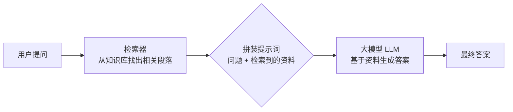
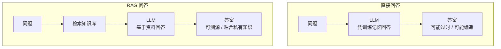
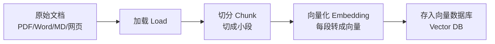
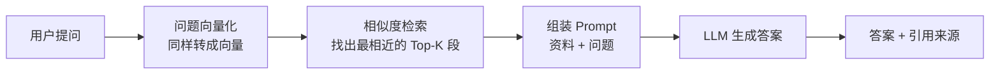
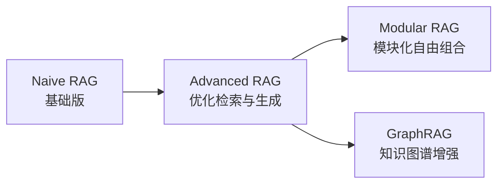

> 面向零基础起步，梳理 RAG（检索增强生成）的核心原理、技术组件、主流框架与上手方法，帮你理解"AI 如何结合自己的知识库回答问题"，并学会搭建一个最简单的 RAG 问答系统。

## 目录

- [一、RAG 是什么](#sec1)
- [二、为什么要 RAG：大模型的三块短板](#sec2)
- [三、核心原理：三步流程](#sec3)
- [四、RAG 与微调（Fine-tuning）怎么选](#sec4)
- [五、核心组件逐个拆解](#sec5)
- [六、RAG 的技术演进](#sec6)
- [七、快速上手：搭建一个知识库问答](#sec7)
- [八、效果不好怎么办：评估与优化](#sec8)
- [九、应用场景与生产注意事项](#sec9)
- [十、学习资源](#sec10)

---

<a id="sec1"></a>
## 一、RAG 是什么

**RAG**（Retrieval-Augmented Generation，检索增强生成）是一种让大语言模型（LLM）**先检索相关资料，再基于资料回答问题**的技术架构。它由 Meta（Facebook AI）在 2020 年论文 *Retrieval-Augmented Generation for Knowledge-Intensive NLP Tasks* 中提出。

> 个人笔记：可以理解为"给 AI 配了一个可以随时翻的图书馆"。模型回答问题前，先去你的知识库里把相关段落"查"出来，结合这些内容再作答——而不是只凭自己脑子（训练数据）里的记忆硬答。



### 1.1 三个字母的含义

| 缩写 | 全称 | 在流程中干什么 |
| --- | --- | --- |
| R | Retrieval（检索） | 从知识库/文档中找到与问题相关的片段 |
| A | Augmented（增强） | 把检索结果附加到模型的输入里 |
| G | Generation（生成） | 让大模型基于"问题 + 资料"生成答案 |

### 1.2 与直接问大模型的区别



---

<a id="sec2"></a>
## 二、为什么要 RAG：大模型的三块短板

| 短板 | 表现 | RAG 的解法 |
| --- | --- | --- |
| **知识过时** | 训练数据有截止时间，不知道最新信息 | 知识库实时更新，检索永远拿最新内容 |
| **没有私有知识** | 不知道你公司内部文档、个人笔记 | 把私有文档放进知识库，检索时取用 |
| **幻觉（编造）** | 不知道答案时一本正经地胡说 | 用检索到的真实资料约束模型，答不上来就明说 |

> 个人笔记：幻觉是大模型天生的毛病——它本质是"预测下一个词"，不是"查数据库"。RAG 的核心价值就是**把模型的回答锚定在真实资料上**，让它"有据可依"。

### 2.1 什么时候需要 RAG

- 想让 AI 回答**你私有/内部**的知识（公司制度、产品文档、个人笔记）；
- 知识**频繁更新**（每天都有新内容）；
- 回答需要**可溯源**（能指出依据来自哪份文档哪一段）；
- 已有大量文档，不想（也无法）用来重新训练模型。

---

<a id="sec3"></a>
## 三、核心原理：三步流程

RAG 分两个阶段：**离线建库（一次性）** 和 **在线问答（每次请求）**。

### 3.1 离线：建立知识库（Indexing）



1. **加载（Load）**：读取各种格式的文档；
2. **切分（Chunking）**：把长文档切成合适的片段（几百字左右）；
3. **向量化（Embedding）**：把每段文字用模型转成一个高维向量（一串数字，语义相近的文字向量也相近）；
4. **存储（Store）**：向量连同原文一起存入向量数据库。

### 3.2 在线：问答（Retrieval + Generation）



1. 把用户问题也转成向量；
2. 在向量库里找出**最相似的 Top-K 个片段**；
3. 把这些片段和问题一起放进 Prompt；
4. 大模型基于资料生成答案，并可以标注引用来源。

> 个人笔记：RAG 的灵魂是"**语义检索**"——不是搜关键词，而是找"意思相近"的内容。你说"怎么退款"，哪怕文档里写的是"退货退款的流程说明"，也能被检索到，因为它语义相关。

---

<a id="sec4"></a>
## 四、RAG 与微调（Fine-tuning）怎么选

很多人混淆两者，其实它们是**互补**的：

| 对比项 | RAG | 微调 |
| --- | --- | --- |
| 干什么 | 给模型"外挂"知识库 | 调整模型本身的参数/行为 |
| 更新知识 | 换文档即可，秒级更新 | 要重新训练，成本高 |
| 成本 | 低（只算检索和调用费用） | 高（需要训练算力 + 高质量标注数据） |
| 可解释性 | 答案可溯源到具体文档 | 无法解释答案来自哪里 |
| 擅长场景 | 事实问答、文档问答、内部知识 | 输出格式、语气风格、领域术语习惯 |
| 对幻觉的改善 | 显著（有资料约束） | 有限（模型还是可能编造） |

> 个人建议：**先上 RAG** 解决"知识"问题；等发现"回答风格/格式/专业性"不满意，再考虑用微调补行为层。绝大多数企业知识库场景，RAG 就够了。

---

<a id="sec5"></a>
## 五、核心组件逐个拆解

### 5.1 文档加载与切分（Chunking）

切分是最容易被忽视、却最影响效果的一步：

| 切分策略 | 做法 | 适用 |
| --- | --- | --- |
| 固定大小 | 按字符数硬切，加少量重叠 | 通用兜底 |
| 按结构切 | 按标题、段落、Markdown 标题切 | 结构清晰的文档 |
| 语义切分 | 用模型判断语义边界再切 | 长文、逻辑复杂文档 |
| 父子切分 | 大块做上下文、小块做检索 | 既想精准又想上下文完整 |

> 个人笔记：切得太小 → 上下文不完整；切得太大 → 检索不精准还浪费上下文窗口。经验上一般 200–800 字一段，带 10% 左右重叠；有结构就按结构切。

### 5.2 向量化（Embedding）

把文字转成向量的模型叫 **Embedding 模型**：

| 模型 | 说明 |
| --- | --- |
| `bge-*`（BAAI） | 中文效果好、开源免费，社区常用 |
| OpenAI `text-embedding-3-*` | 英文和通用效果好，需付费 |
| `m3e` / `text2vec` | 国产开源中文 Embedding |

> 注意：**查询和文档要用同一个 Embedding 模型**，否则向量空间不一致，检索会失效。

### 5.3 向量数据库

| 工具 | 特点 | 场景 |
| --- | --- | --- |
| **FAISS**（Meta） | 轻量库，无服务，内存检索 | 单机、原型、小规模 |
| **Chroma** | 轻量、API 友好，Python 首选 | 学习、原型 |
| **Milvus** | 分布式、高性能、云原生 | 生产环境大规模 |
| **Qdrant / Weaviate / pgvector** | 各有生态优势 | 看团队技术栈 |

> 个人建议：学习用 **Chroma/FAISS**，上生产且数据量大用 **Milvus**；如果团队已有 PostgreSQL，先试试 `pgvector` 最省事。

### 5.4 检索（Retrieval）

| 方式 | 原理 | 优点 / 缺点 |
| --- | --- | --- |
| 向量检索 | 算语义相似度 | 懂语义 / 对精确数字、专有名词弱 |
| 关键词检索（BM25） | 经典词频统计 | 精确匹配强 / 不懂语义 |
| 混合检索 | 两者结合，再合并排序 | 兼顾语义与精确 / 需要调权重 |
| **Rerank 重排** | 先用廉价检索召回 Top-50，再用重排模型精排 Top-5 | 准确率显著提升 / 多一次模型调用 |

> 个人笔记：**混合检索 + Rerank** 是目前生产环境性价比最高的组合——BM25 兜住"精确名词"，向量兜住"语义相近"，重排模型把最相关的排到最前面。

### 5.5 生成（Generation）

- 把检索结果拼进 Prompt，常见结构：`系统指令 + 检索资料 + 用户问题`；
- 明确要求模型："**仅根据提供的资料回答**，资料中没有就回答不知道"（大幅降低幻觉）；
- 要求模型标注来源：`[1]` 对应第几段资料，方便用户溯源。

```text
你是知识库助手。请只根据以下资料回答用户问题，资料中没有相关信息时，
明确回答"资料中未找到"，不要编造。回答末尾用 [n] 标注引用来源。

资料：
[1] 退款需在收货后 7 天内申请……
[2] 退货需保持商品完好……

问题：如何申请退款？
答案：
```

---

<a id="sec6"></a>
## 六、RAG 的技术演进



| 阶段 | 特点 | 典型改进 |
| --- | --- | --- |
| **Naive RAG** | 最简单的"检索→拼接→生成" | 基线方案，效果一般 |
| **Advanced RAG** | 检索前后都做优化 | 查询改写（Query Rewriting）、HyDE（用模型先写假答案再检索）、Rerank、chunk 优化 |
| **Modular RAG** | 各环节模块化、可插拔 | 可加入记忆、路由、多轮改写、Agent 工具调用 |
| **GraphRAG**（微软） | 先抽取文档实体与关系建图 | 擅长"跨文档关联""全局性问题"（如总结整个知识库） |

> 个人笔记：别一上来就上高级方案。**先跑通 Naive RAG，用评估指标找瓶颈**——检索不准就优化检索（混合+重排），答案不好就优化 Prompt 和生成，哪里痛医哪里。

---

<a id="sec7"></a>
## 七、快速上手：搭建一个知识库问答

### 7.1 方案一：零代码平台（最快）

- **Dify / FastGPT / RAGFlow**：开源的可视化 RAG 平台，上传文档 → 自动建库 → 直接网页对话，几分钟跑通，适合先体验和做产品验证。

### 7.2 方案二：Python + LlamaIndex（推荐学习）

```bash
pip install llama-index llama-index-vector-stores-chroma chromadb
```

```python
from llama_index.core import VectorStoreIndex, SimpleDirectoryReader
from llama_index.vector_stores.chroma import ChromaVectorStore
import chromadb

# 1. 加载文档（把 PDF/Word/txt 放进 docs 文件夹）
documents = SimpleDirectoryReader("docs").load_data()

# 2. 建向量库并索引
chroma_client = chromadb.PersistentClient(path="./chroma_db")
vector_store = ChromaVectorStore(chroma_client=chroma_client.get_or_create_collection("kb"))
index = VectorStoreIndex.from_documents(documents, vector_store=vector_store)

# 3. 问答（默认调用 OpenAI；接入国产模型改 llm 参数即可）
query_engine = index.as_query_engine()
response = query_engine.query("退款流程是什么？")
print(response)
```

### 7.3 方案三：Python + LangChain

```bash
pip install langchain langchain-community chromadb
```

```python
from langchain_community.document_loaders import TextLoader
from langchain.text_splitter import RecursiveCharacterTextSplitter
from langchain_community.vectorstores import Chroma
from langchain_openai import ChatOpenAI, OpenAIEmbeddings

# 1. 加载 + 切分
docs = TextLoader("note.txt").load()
chunks = RecursiveCharacterTextSplitter(chunk_size=500, chunk_overlap=50).split_documents(docs)

# 2. 向量化 + 入库
vectorstore = Chroma.from_documents(chunks, OpenAIEmbeddings())

# 3. 检索 + 生成
retriever = vectorstore.as_retriever(search_kwargs={"k": 4})
llm = ChatOpenAI(model="gpt-4o-mini")
from langchain.chains import RetrievalQA
qa = RetrievalQA.from_chain_type(llm=llm, retriever=retriever)
print(qa.invoke("退款流程是什么？"))
```

> 说明：以上示例默认使用 OpenAI 服务。国内可把 `ChatOpenAI` / LLM 参数换成豆包、通义千问、DeepSeek 等任意兼容 OpenAI 接口的模型，Embedding 同理换成 `bge` 等国产模型即可。

---

<a id="sec8"></a>
## 八、效果不好怎么办：评估与优化

### 8.1 先评估，再优化

推荐用 **RAGAS** 框架量化评估：

```bash
pip install ragas
```

核心指标：

| 指标 | 衡量什么 | 低分说明 |
| --- | --- | --- |
| **Faithfulness（忠实度）** | 答案是否忠于检索到的资料 | 幻觉严重，改 Prompt 或换模型 |
| **Answer Relevancy（答案相关性）** | 答案是否答到点上 | 生成环节问题，优化 Prompt |
| **Context Precision / Recall（检索质量）** | 检索到的资料是否相关、是否齐全 | 检索环节问题，优化切分/检索策略 |

> 个人笔记：先跑一批测试问题，看分数集中在哪个环节，再对症下药。**没有评估就优化 = 盲人摸象**。

### 8.2 常见问题速查表

| 现象 | 可能原因 | 处理 |
| --- | --- | --- |
| 答非所问 | 检索没召回相关内容 | 调大 Top-K、改混合检索、检查切分大小 |
| 答案编造 | 资料缺失或 Prompt 没约束 | 强制"资料中没有就回答不知道"，加引用标注 |
| 引用错误 | 检索到不相关段落 | 加 Rerank，检查 Embedding 模型与语言是否匹配 |
| 上下文太长 | chunk 太大或召回太多 | 减小 chunk、降低 Top-K |
| 新文档不生效 | 没有重新建索引 | 文档更新后要重新切分+入库 |
| 多轮对话失忆 | 没做对话记忆 | 把历史对话摘要也放进 Prompt |

---

<a id="sec9"></a>
## 九、应用场景与生产注意事项

### 9.1 典型场景

| 场景 | 知识库内容 | 典型产品形态 |
| --- | --- | --- |
| 企业知识库问答 | 制度、流程、FAQ | 内部智能助手 |
| 产品文档问答 | 产品手册、API 文档 | 官网智能客服 |
| 个人知识管理 | 笔记、收藏、读书摘录 | 个人 AI 助手 |
| 客服机器人 | 商品/售后/物流规则 | 电商智能客服 |
| 法律/医疗辅助 | 法规、指南（注意合规） | 辅助检索工具（需专业人士复核） |

### 9.2 生产环境注意事项

- **权限与安全**：不同用户能看到的知识范围不同，检索前要做权限过滤；
- **敏感数据**：私有文档尽量本地部署（Embedding 和 LLM 都别走公有云）;
- **数据更新**：设计文档变更 → 自动重建索引的流程；
- **成本控制**：Embedding 调用和向量库存储都有成本，文档量大要评估；
- **兜底设计**：检索不到相关内容时，明确回答"未找到"，别硬答；
- **合规**：医疗、法律、金融等领域的答案必须有人工复核环节。

> ⚠️ 重要：RAG 降低幻觉，但不能**消灭**幻觉。涉及人身安全、财务、法律的输出，永远保留人工审核。

---

<a id="sec10"></a>
## 十、学习资源

- **RAG 原始论文**：*Retrieval-Augmented Generation for Knowledge-Intensive NLP Tasks*（2020，Meta）
- **LangChain 官方文档**：<https://python.langchain.com/docs/>
- **LlamaIndex 官方文档**：<https://docs.llamaindex.ai/>
- **RAGAS 评估框架**：<https://docs.ragas.io/>
- **微软 GraphRAG**：<https://github.com/microsoft/graphrag>
- **Dify 开源平台**：<https://github.com/langgenius/dify>

### 建议的学习路线

1. 先想清楚"我要让 AI 回答哪些我自己的知识"，准备 3–5 份真实文档；
2. 用 Dify 等零代码平台跑通一个问答 demo，观察效果；
3. 用 LlamaIndex 的示例代码本地复现一遍，理解"切分→向量化→检索→生成"每一步；
4. 用 RAGAS 对 20–50 个测试问题做评估，找到瓶颈；
5. 进阶：实践混合检索 + Rerank、查询改写，再研究 GraphRAG 和 Agent + RAG。

> 个人笔记：RAG 的坑大多不在"AI"，而在**工程**——文档质量、切分策略、检索配置、评估体系。把最基础的链路跑通、用指标说话，比追着各种花哨新框架重要得多。
