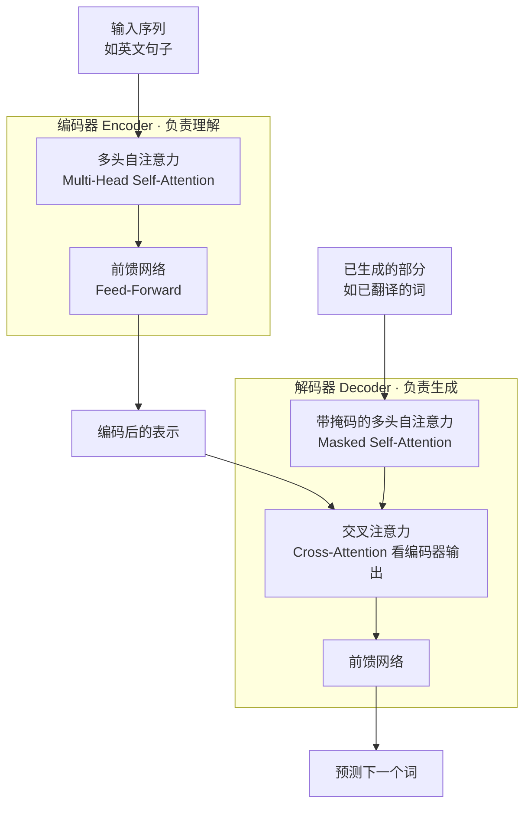
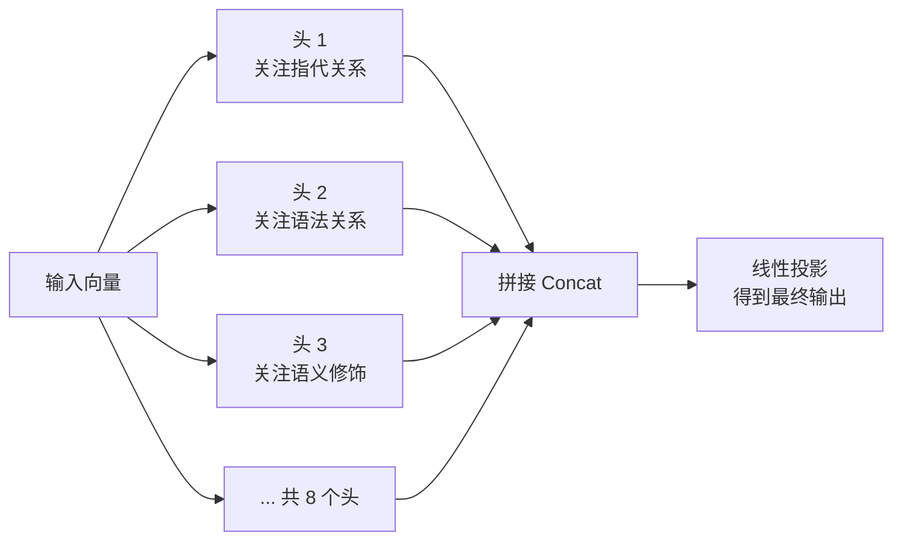
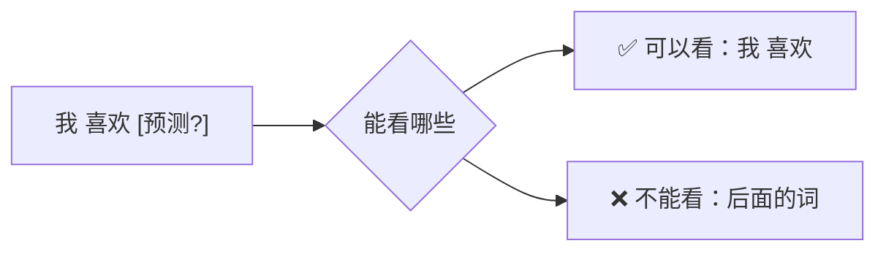
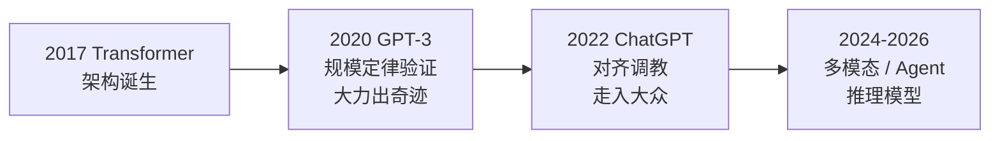

> 面向零基础起步，把 2017 年《Attention Is All You Need》这篇改变 AI 历史的论文拆开讲清楚：为什么需要它、它由哪些部件组成、注意力机制到底怎么算，以及它如何一步步演变成今天的大模型。

## 目录

- [一、Transformer 为什么诞生](#sec1)
- [二、整体架构：一张图看懂](#sec2)
- [三、输入怎么进模型：Embedding 与位置编码](#sec3)
- [四、核心机制：自注意力（Self-Attention）](#sec4)
- [五、多头注意力：从"一个视角"到"多个视角"](#sec5)
- [六、残差连接与层归一化](#sec6)
- [七、前馈网络：注意力之后的"独立思考"](#sec7)
- [八、三种 Mask：模型如何"守住边界"](#sec8)
- [九、Encoder 与 Decoder：两种使用方式](#sec9)
- [十、预训练目标：BERT 与 GPT 的分野](#sec10)
- [十一、从 Transformer 到大模型](#sec11)
- [十二、学习资源](#sec12)

---

<a id="sec1"></a>
## 一、Transformer 为什么诞生

### 1.1 之前的序列模型有什么问题

在 Transformer 之前，处理文本序列（翻译、生成）的主力是 **RNN（循环神经网络）/ LSTM**。它们有两个致命短板：

| 短板 | 表现 | 后果 |
| --- | --- | --- |
| **串行处理** | 必须一个词一个词按顺序读 | 训练慢，无法并行利用 GPU |
| **长距离记忆差** | 信息在传递中逐渐衰减 | 句子一长，"前面说的人"就忘了 |

**例：** "小明昨天去了公园，他玩得很开心"——RNN 读到"他"时，前面的"小明"已经被"冲淡"了，容易指代错误。

### 1.2 Transformer 的破局

2017 年 6 月，Google 发表论文 **《Attention Is All You Need》**（注意力就是一切），提出 Transformer 架构：

- **并行计算**：所有词同时处理，不再排队；
- **注意力机制**：每个词直接"看到"句中所有其他词，长距离依赖一次到位；
- **效果碾压**：机器翻译质量全面超过 RNN/LSTM，训练还快得多。

> 个人笔记：论文标题就是它的核心观点——"**注意力就是一切，循环结构可以不要了**"。这篇论文后来被视为大模型时代的"地基"，GPT、BERT、Claude、豆包……今天所有主流大模型都是它的后代。

---

<a id="sec2"></a>
## 二、整体架构：一张图看懂

Transformer 原始架构分两半：**Encoder（编码器）** 和 **Decoder（解码器）**。



- **Encoder**：读完整段输入，理解"这句话什么意思"；
- **Decoder**：一边看输入的理解结果，一边**逐个生成**输出词；
- 每个"块"内部都是同一套结构：**注意力 → 前馈 → 残差 → 归一化**，堆叠 N 层（原文 6 层）。

> 关键认知：Transformer 的输入输出都是**向量**。文本进来先变成数字（Embedding），所有计算都在数字上做，最后再变回词。

---

<a id="sec3"></a>
## 三、输入怎么进模型：Embedding 与位置编码

### 3.1 词嵌入（Embedding）：把词变成向量

计算机不认识"猫"这个字，只认识数字。**Embedding（嵌入）** 就是把每个 token 映射成一个高维向量（一串数字，比如 512 维）：

```
"猫" → [0.12, -0.35, 0.78, ... , 0.02]   （512 个数）
```

**关键性质**：语义相近的词，向量也相近（"猫"和"狗"的向量距离近，"猫"和"汽车"远）。这个映射表是在训练中自动学出来的。

### 3.2 位置编码：给词"排座位"

注意力机制有个天然缺陷——**它不分词序**："猫追狗"和"狗追猫"在注意力看来是一样的（每个词都能看到所有词，但不知道先后）。

所以需要给每个词的位置打上标记，这就是**位置编码（Positional Encoding）**：

- **做法**：把"第几个位置"也编码成一个向量，加到词的 Embedding 上；
- **原文方案**：用正弦/余弦函数生成固定位置向量；
- **现代方案**：后续模型改进出 RoPE（旋转位置编码，LLaMA 等使用）等，效果更好。

> 个人笔记：可以理解为——词的 Embedding 是"这个词是谁"，位置编码是"它站在第几位"。两者相加，模型就知道"谁在什么位置"，才能正确理解语序。没有位置编码，Transformer 就退化成一个"词袋模型"。

---

<a id="sec4"></a>
## 四、核心机制：自注意力（Self-Attention）

这是 Transformer 的心脏，务必弄懂。虽然术语吓人，底层逻辑其实很简单。

### 4.1 一句话理解

**自注意力：让每个词"看看"句子里的所有其他词，算出自己该重点关注谁，再把重要信息吸收进来。**

例子：在"小明昨天去了公园，他玩得很开心"里，处理到"他"时，注意力机制会让"他"重点看向"小明"——这就是它理解指代关系的方式。

### 4.2 Q / K / V 三件套

注意力机制引入三个角色：

| 角色 | 全称 | 通俗理解 | 打个比方 |
| --- | --- | --- | --- |
| **Q** | Query（查询） | "我在找什么" | 你去图书馆要查的主题 |
| **K** | Key（键） | "我有什么可以被匹配" | 每本书的标题和标签 |
| **V** | Value（值） | "匹配上后我要取的内容" | 书里的正文内容 |

每个词都会生成自己的 Q、K、V（由输入向量乘三个不同的权重矩阵得到）。

### 4.3 计算四步

对每个词，注意力按以下四步计算：

```
第 1 步：算相似度 —— 用当前词的 Q 与句中所有词的 K 做点积
          （点积越大 = 越相关）

第 2 步：缩放 —— 除以 √d_k（d_k 是向量维度），防止数值过大

第 3 步：归一化 —— 用 Softmax 把分数变成"注意力权重"（总和为 1）

第 4 步：加权求和 —— 用权重对所有词的 V 加权求和，得到输出
```

公式（论文原文）：

```
Attention(Q, K, V) = softmax( Q·Kᵀ / √d_k ) · V
```

### 4.4 为什么除以 √d_k

- 点积会随向量维度增大而变大；
- 数值太大时，Softmax 会"两极分化"（一个接近 1，其余接近 0），梯度极小，训练不动；
- 除以 √d_k 把数值拉回合理范围，训练更稳定。

### 4.5 一个直观小例子

句子："小明 喜欢 跑步"

处理"喜欢"这个词时（简化示意）：

```
"喜欢"的 Q 与"小明"的 K 点积 → 0.8  （相关：谁喜欢？→ 小明）
"喜欢"的 Q 与"喜欢"的 K 点积 → 1.0  （和自己最相关）
"喜欢"的 Q 与"跑步"的 K 点积 → 0.6  （相关：喜欢什么？→ 跑步）

Softmax 归一化后 ≈ [0.33, 0.40, 0.27]
输出 = 0.33×V(小明) + 0.40×V(喜欢) + 0.27×V(跑步)
```

最终"喜欢"这个位置的输出，就"融合"了它认为重要的信息——既知道是谁在喜欢，也知道喜欢什么。

> 个人笔记：注意力机制最妙的点是**它没有任何"写死"的规则**——该关注谁、关注多少，全部由数据训练自动学出来。训练得越久，它越知道"代词要看先行词、动词要看主语和宾语"这类语言规律。这就是"Attention Is All You Need"的含义：不需要人设计规则，注意力自己就能学会一切。

---

<a id="sec5"></a>
## 五、多头注意力：从"一个视角"到"多个视角"

### 5.1 单头注意力的局限

一个注意力头只能学"一种关注模式"。但语言中的关系是多样的：

- 指代关系（"他"→"小明"）；
- 语法关系（"喜欢"→"跑步"）；
- 语义修饰（"红色的"→"苹果"）……

一种模式学一种，不够用。

### 5.2 多头注意力（Multi-Head Attention）

**多头**就是把注意力做多份，每份有不同的权重矩阵，关注不同类型的关系：



- 原文用 **h=8 个头**，每个头在低维子空间（64 维）里算；
- 所有头的输出**拼接**起来，再经过一次线性变换；
- 计算量基本不变（拆开算再拼回），但表达能力大幅提升。

> 类比：单头注意力像一个只关心"谁在说什么"的听众；多头注意力像**一组专家各听各的**——有人盯指代、有人盯语气、有人盯逻辑，最后碰头汇总，理解就全面了。

---

<a id="sec6"></a>
## 六、残差连接与层归一化

Transformer 每个子层（注意力、前馈）外面都包了一层 **Add & Norm**：

### 6.1 残差连接（Residual Connection / Add）

```
输出 = 输入 + 子层的计算结果
```

- 让梯度可以"抄近道"直接流回浅层，解决深层网络的**梯度消失**问题；
- 网络再深也能训练得动（Transformer 可以堆 100+ 层）。

> 类比：就像做菜时"保留一份原始食材"——不管后续加工（注意力/前馈）把味道改成什么样，最后都要把原味加回来一点，防止越做越"跑偏"。

### 6.2 层归一化（Layer Normalization / Norm）

- 把每个位置上的向量数值**标准化**（均值 0、方差 1），再缩放平移；
- 作用：数值稳定、训练更快更稳，不依赖批次大小。

### 6.3 完整的一个"块"

```mermaid
graph TB
    A[输入 X] --> B[多头注意力]
    B --> C[残差连接<br/>X + Attention(X)]
    C --> D[层归一化]
    D --> E[前馈网络 FFN]
    E --> F[残差连接<br/>+ 层归一化]
    F --> G[输出<br/>进入下一层]
```

每个"块"内部都是：**注意力 → 残差 → 归一化 → 前馈 → 残差 → 归一化**，重复 N 层。

---

<a id="sec7"></a>
## 七、前馈网络：注意力之后的"独立思考"

### 7.1 结构

前馈网络（Feed-Forward Network, FFN）是每个位置独立的两层全连接：

```
FFN(x) = 激活函数(x·W₁ + b₁)·W₂ + b₂
```

- 第一层把维度从 d_model（如 512）放大到 4 倍（如 2048）；
- 中间过激活函数（ReLU / GELU）引入非线性；
- 第二层再压回 512 维。

### 7.2 作用：和注意力分工

| 模块 | 干什么 | 类比 |
| --- | --- | --- |
| 注意力 | **词与词之间交流信息**（横向） | 开会讨论、信息共享 |
| 前馈网络 | **每个词自己深度加工**（纵向） | 开完会各自回去写方案 |

注意力负责"谁和谁有关"，前馈负责"对这个词本身做复杂变换"。两者交替，模型才能既理解关系、又加工内容。

> 个人笔记：一个常见的直觉——**注意力是"社交"（词与词之间），前馈是"自习"（每个词独自思考）**。Transformer 的每一层都是一次"先社交、后自习"的循环，层数越深，"思考"越抽象、越接近高层语义。

---

<a id="sec8"></a>
## 八、三种 Mask：模型如何"守住边界"

Mask（掩码）就是**告诉模型"哪些位置不能看"**。Transformer 里主要有三种：

| Mask | 用在哪 | 作用 |
| --- | --- | --- |
| **Padding Mask** | Encoder 和 Decoder | 忽略填充位（句子长度不齐时补的无效位置） |
| **Causal Mask（因果掩码）** | Decoder 的自注意力 | 只允许看**当前及之前**的词，禁止偷看未来 |
| **Cross-Attention Mask** | Decoder 的交叉注意力 | 只让 Decoder 关注 Encoder 输出的有效位置 |

### 8.1 因果掩码为什么重要（生成的关键）

Decoder 是**逐词生成**的：预测第 3 个词时，只能依据已生成的 1、2 个词，不能"偷看"正确答案。



训练时，把未来位置遮掉（设为 −∞，Softmax 后权重为 0），让模型只能基于过去预测未来——这就是**自回归（Autoregressive）**的本质：预测下一个词，拼回去，再预测下一个。

> 个人笔记：因果掩码是整个"生成式 AI"的幕后功臣——ChatGPT 能一段一段往下写，靠的就是"只能看前面、不能看后面"这个约束。它保证了模型在训练时练的就是"真正生成"这件事，而不是"看懂答案再抄"。

---

<a id="sec9"></a>
## 九、Encoder 与 Decoder：两种使用方式

原始 Transformer 是"编码器+解码器"完整结构，但后续模型发展出三种用法：

| 用法 | 结构 | 代表模型 | 擅长 |
| --- | --- | --- | --- |
| **Encoder-only** | 只用编码器 | **BERT**（2018） | 理解型任务：分类、检索、命名实体识别 |
| **Decoder-only** | 只用解码器 | **GPT 系列** | 生成型任务：对话、写作、代码 |
| **Encoder-Decoder** | 完整结构 | T5、BART | 转换型任务：翻译、摘要 |

### 9.1 为什么今天主流是 Decoder-only

2018 年 BERT 曾称霸理解任务，但 2020 年后 GPT 系列反超，原因：

| 维度 | BERT（Encoder） | GPT（Decoder） |
| --- | --- | --- |
| 训练目标 | 盖词猜词（理解） | 预测下一个词（生成） |
| 任务统一性 | 每种任务要微调适配 | 一个目标通吃所有任务 |
| 扩展性 | 好但有限 | **规模越大能力越强（涌现）** |
| 生态 | 被生成式浪潮边缘化 | 成为大模型标准形态 |

> 关键认知：今天的"大语言模型"（GPT、Claude、DeepSeek、豆包）基本都是 **Decoder-only 的堆叠 Transformer**——把解码器部分做得超级大、训练数据超级多，就涌现出了对话、推理、编程等能力。所以可以说：**大模型 = 放大了无数倍的 Transformer 解码器**。

---

<a id="sec10"></a>
## 十、预训练目标：BERT 与 GPT 的分野

同样的 Transformer 骨架，用不同的**训练任务**（预训练目标），会训练出不同性格的模型。

### 10.1 BERT：盖词猜词（MLM）

**MLM**（Masked Language Model，掩码语言模型）：把句子中的词随机盖住 15%，让模型猜被盖住的词。

```
输入: 小明 [MASK] 公园，[MASK] 玩得很开心。
目标: 预测 [MASK] = 去了 / 他
```

- 特点：**双向**——猜词时能看到左右两边所有词；
- 收获：深度语言理解能力，适合做"读"的任务。

### 10.2 GPT：预测下一个词（自回归）

**自回归**（Autoregressive）：给定前面的词，预测下一个词。

```
输入: 小明去了公园，他玩得很
目标: 预测下一个词 = 开心
```

- 特点：**单向**——只能看左边；
- 收获：生成能力，适合做"写"的任务。

### 10.3 对比

| 对比项 | BERT | GPT |
| --- | --- | --- |
| 任务 | 盖词猜词（MLM） | 预测下一个词 |
| 方向 | 双向 | 单向（从左到右） |
| 核心能力 | 理解 | 生成 |
| 衍生 | Embedding、检索、分类 | 对话、写作、Agent |

> 个人笔记：一个"读得懂"（BERT），一个"写得来"（GPT）。历史证明"写得来"更有扩展性——因为只要能生成，就能通过提示词完成几乎所有任务；而"读得懂"每类任务都要单独训练适配。这就是为什么我们日常用的 AI 全是生成式模型。

---

<a id="sec11"></a>
## 十一、从 Transformer 到大模型

### 11.1 三层递进



### 11.2 后续关键技术演进

| 技术 | 解决什么问题 | 代表 |
| --- | --- | --- |
| **规模定律（Scaling Law）** | 参数、数据、算力同增，能力稳定提升 | GPT-3（1750 亿参数） |
| **对齐（RLHF）** | 让模型听话、有用、安全 | InstructGPT / ChatGPT |
| **混合专家（MoE）** | 参数量巨大但每次只激活一部分，省算力 | Mixtral、DeepSeek-V3 |
| **KV Cache** | 推理时缓存历史键值，加速生成 | 所有商用模型 |
| **RoPE 等位置编码改进** | 支持超长上下文（128K、1M） | LLaMA、Qwen |
| **多模态扩展** | 同一模型处理文字、图像、音频、视频 | GPT-4o、Gemini |
| **推理模型（CoT）** | 显式"想清楚再答"，提升复杂推理 | o1、DeepSeek-R |

> 个人笔记：理解 Transformer 之后再看 LLM 的新闻，会发现所有新模型都只是在三个维度上做文章——**架构微调**（MoE、位置编码）、**训练数据**（更大更干净）、**对齐与推理**（RLHF、CoT）。骨架还是 2017 年那个骨架。这也是为什么《LLM 百科全书》里说"底层框架很稳定"。

---

<a id="sec12"></a>
## 十二、学习资源

- **论文原文（必读）**：《Attention Is All You Need》（Vaswani et al., 2017）——Transformer 的源头，可读中文解读版；
- **可视化视频（强烈推荐）**：3Blue1Brown《深度学习》系列中的注意力与 Transformer 两集——用动画把 QKV 讲得极其直观；
- **图解文章**：Jay Alammar《The Illustrated Transformer》（图解 Transformer）——最经典的图文解读，必看；
- **课程**：李宏毅《机器学习》Transformer 章节、Hugging Face NLP Course；
- **动手实践**：Hugging Face `transformers` 库（用几行代码加载 BERT/GPT 玩一玩）、`tiktoken`（看 token 怎么切分）；
- **中文资料**：哈工大《大语言模型综述》中关于 Transformer 的章节。

### 建议的学习路线

1. 先看 3Blue1Brown 的注意力视频，建立直观印象；
2. 读 Jay Alammar 的图解文章，对应上 Q/K/V、多头、位置编码这些名词；
3. 回到本文逐节对照，把每个组件在整体中的位置画一遍（不看图默写架构图）；
4. 用 Hugging Face 加载一个小的 BERT/GPT，看 token 化和输出；
5. 进阶：阅读论文原文相关章节，理解缩放点积注意力的数学细节，再看 MoE、RoPE 等现代改进。

> 个人笔记：Transformer 看起来组件多，其实核心只有三件事——**注意力（交流信息）、前馈（加工信息）、残差+归一化（让深网络能训练）**，位置编码解决"词序"，Mask 解决"生成时不能偷看"。把这三件事的直觉建立起来，论文里的所有细节都是围绕它们打补丁。学的时候别背公式，先讲清楚"它在解决什么问题"。
