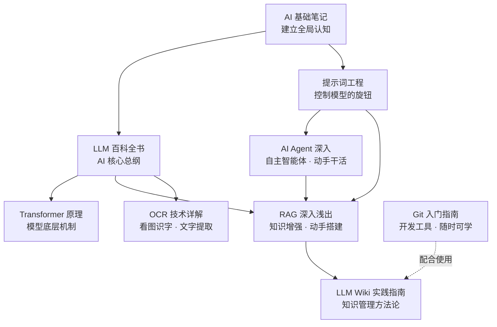

> 这是我的 AI 知识库门户，从这里进入各篇笔记。按"基础 → 核心 → 技术专题 → 方法论"组织，建议沿学习路径顺序阅读，也可按需直接跳到对应专题。

## 学习路径图

## 笔记清单

| 笔记 | 分类 | 一句话简介 | 建议阅读时机 |
| --- | --- | --- | --- |
| AI 基础 | 基础入门 | AI 概念、发展脉络与关键术语 | 第一步，零基础必读 |
| LLM 百科全书 | AI 核心知识 | LLM 的定义、原理、模型谱系与生态总纲 | 建立 AI 全局观 |
| Transformer 原理 | AI 核心知识 | 注意力机制、多头、位置编码与模型演进 | 想理解大模型底层时 |
| RAG 深入浅出 | AI 技术专题 | 检索增强生成：原理、组件、搭建与评估 | 想动手做知识库问答时 |
| AI Agent 深入 | AI 技术专题 | 智能体：ReAct、工具调用、MCP、框架与实操 | 想让 AI 自己干活时 |
| 提示词工程 | AI 技术专题 | 六要素、Few-shot、思维链、系统提示词与调优 | 想让 AI 输出更可控时 |
| OCR 技术详解 | AI 技术专题 | 光学字符识别：原理、工具、Python 调用 | 需要提取图片文字时 |
| Git 入门指南 | 开发工具 | 版本控制：命令、分支、协作流程 | 写代码/管理文件时随时学 |
| LLM Wiki 实践指南 | 方法论 | 用 LLM 持续构建个人知识库的模式 | 想长期管理知识时 |

## 建议学习顺序

1. **AI 基础** → 建立 AI 是什么的整体认知；
2. **LLM 百科全书** → 深入理解核心引擎大语言模型；
3. **Transformer 原理** → 钻进模型底层，理解注意力机制（大模型的地基）；
4. **提示词工程** → 学会控制模型输出（对话、RAG、Agent 都离不开）；
5. **RAG 深入浅出** → 动手搭第一个知识库问答（与本文档思路一脉相承）；
6. **AI Agent 深入** → 让 AI 从"会回答"升级到"会干活"（可与 RAG 结合使用）；
7. **OCR 技术详解** 或 **Git 入门指南** → 按需补充技能（提取文字 / 管理代码）；
8. **LLM Wiki 实践指南** → 用这套模式长期经营自己的知识库。

> 个人笔记：知识库本身就是一个"持续积累、不断复利"的产物——像 LLM Wiki 实践指南 里说的，把收藏变成构建，每读一篇就沉淀一篇。

## 笔记规范（维护约定）

- **命名**：主题 + 类型词（基础 / 指南 / 详解 / 深入浅出 / 百科全书 / 实践指南）；
- **frontmatter**：每篇带 `title / topic / category / tags / created / status` 字段，可用 Dataview 插件做动态列表；
- **双链**：每篇末尾有"相关笔记"，用 `笔记名` 互相连通；
- **目录锚点**：每篇正文含 `## 目录` 与 `secN` 锚点，便于跳转。

> 新笔记请遵守以上规范，保持知识库的统一与可检索性。
