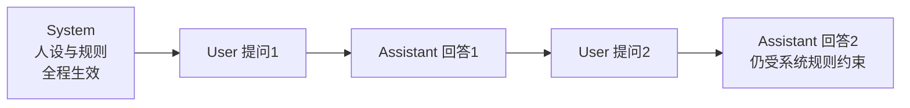
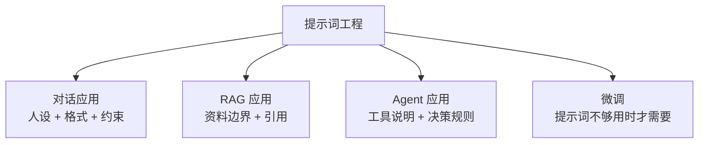

> 面向零基础起步，系统梳理提示词工程（Prompt Engineering）的核心方法：基本结构、上下文学习、思维链、结构化输出、系统提示词设计与调优迭代，帮助你把同一个模型"调教"出不同水平的表现。示例尽量贴合售后排障与知识库场景。

## 一、提示词工程是什么

**提示词工程（Prompt Engineering）**：通过精心设计输入给模型的指令（Prompt），引导模型产出更准确、更符合需求的输出。

> 个人笔记：可以这样理解——**模型的能力是固定的，提示词是你控制这台"机器"的操作面板**。同一个模型，问"路由器连不上网怎么办"和给它完整背景+排查要求，得到的答案质量天差地别。提示词工程就是学会"怎么把话说明白、说全面"。

### 1.1 为什么提示词这么重要

| 事实 | 说明 |
| --- | --- |
| 模型"上限"由训练决定 | 提示词无法让模型学会它不知道的事 |
| 模型"发挥"由提示词决定 | 同一个模型，提示词不同，输出质量差异巨大 |
| 提示词是唯一零成本杠杆 | 不用训练、不用花钱，改几行字就能提升效果 |
| 提示词影响所有 AI 应用 | 对话、RAG、Agent，全部依赖提示词 |

### 1.2 关键认知：模型是"听话的续写者"

- 模型本质是"预测下一个词"的机器；
- 它**没有真正的意图**，只是根据你的输入推断"你想要什么"；
- 所以提示词越模糊，它越容易"自由发挥"；提示词越清晰，它越容易"按你说的做"。

> 一句话总结：**提示词工程 = 把"模糊的期望"翻译成"模型能执行的结构化指令"。**

---

<a id="sec2"></a>
## 二、基本结构：六要素公式

《AI 基础》里提过基本公式，这里展开：

```
角色 + 任务 + 背景 + 要求 + 示例 + 输出格式
```

| 要素 | 作用 | 例子 |
| --- | --- | --- |
| **角色（Role）** | 限定回答视角和专业度 | "你是一位资深网络排障工程师" |
| **任务（Task）** | 明确要做什么 | "请诊断下面的问题并给出解决方案" |
| **背景（Context）** | 提供必要信息，减少猜测 | "客户使用 SFT1200 路由器，拨号上网正常但无法访问 IPv6 网站" |
| **要求（Constraints）** | 约束行为边界 | "不要建议重启以外的操作；只基于给出的信息回答" |
| **示例（Example）** | 示范期望的输出样子 | 给一个"问题→方案"的示例 |
| **输出格式（Format）** | 规定结果形态 | "用编号列表输出，每步不超过 50 字" |

### 2.1 一个完整示例（贴合售后场景）

```text
你是一位资深路由器售后工程师（角色）。

客户报障：路由器（SFT1200）Wi-Fi 能连上，但手机和电脑都无法上网，
指示灯状态正常，宽带拨号已成功（任务+背景）。

请按以下要求排查并回复（要求）：
1. 只基于上面给出的信息推理，不要假设额外条件；
2. 按"最可能原因 → 验证方法 → 解决操作"的结构回答；
3. 最多给出 3 个可能原因，按概率从高到低排序；
4. 每个原因的操作步骤不超过 3 步，每步不超过 30 字；
5. 如果信息不足，明确列出还需要向客户确认哪些信息（输出格式）。
```

> 个人笔记：新手最常见的错误是"只给任务、不给背景"——模型只能猜。**把背景、约束、格式一次说全，是提示词质量提升最快的一步**。我平时写排障 SOP 类的提示词，都会把"客户环境+已做排查+禁止事项"三样写进去。

---

<a id="sec3"></a>
## 三、核心心法：清晰具体

### 3.1 模糊 vs 具体

| 模糊的提示词 | 具体化的提示词 |
| --- | --- |
| "帮我写个售后邮件" | "给一位路由器无法拨号上网的客户写回复邮件，语气专业友好，先道歉、再给 3 步排查步骤、最后说明若无效可联系人工，控制在 150 字内" |
| "总结这篇文章" | "用 5 条要点总结这篇文章，每条不超过 30 字，并标注它提到的 3 个关键风险" |
| "解释一下 RAG" | "用打比方的方式向零基础的新人解释 RAG 是什么，先给一句话定义，再用'图书馆'类比展开，最后说明它和直接问大模型的区别" |

### 3.2 具体化的四个抓手

1. **给数字**：字数、条数、步骤数、时间范围；
2. **给结构**：先说结论还是先列证据，用什么层级；
3. **给边界**：明确"不要做什么"（负面约束）；
4. **给受众**：写给谁看（领导/客户/新人），决定语气和专业度。

### 3.3 负面约束同样重要

模型不擅长"猜到你不想要什么"，直接告诉它：

- "不要使用'可能''或许'等模糊词，不确定就写'未知'";
- "不要编造设备型号和参数，只使用我提供的信息";
- "不要输出 Markdown 表格，用纯文本列表"。

> 个人笔记：负面约束是**防止幻觉最便宜的方案**——一句"不确定就说不确定"，比事后人工核验省力得多。售后场景里，我常加"不要给出未经验证的配置命令"这类红线。

---

<a id="sec4"></a>
## 四、上下文学习：Zero-shot / Few-shot

### 4.1 三个概念

| 方式 | 做法 | 适用 |
| --- | --- | --- |
| **Zero-shot（零样本）** | 不给示例，直接描述任务 | 通用任务，模型本身就会 |
| **One-shot（单样本）** | 给 1 个示例 | 需要格式/风格示范 |
| **Few-shot（少样本）** | 给 2-5 个示例 | 新任务、特殊格式、特定风格 |

### 4.2 Few-shot 为什么有效

模型看到示例，就能"照葫芦画瓢"——它从示例中推断出**任务模式**（输入长什么样、输出长什么样）。

```text
请把下面的报障描述归类为：硬件故障 / 配置问题 / 网络问题 / 其他。

示例：
"路由器指示灯全灭，按电源键无反应" → 硬件故障
"Wi-Fi 能连上但无法上网，重启后恢复" → 配置问题
"只有特定网站打不开，其他正常" → 网络问题

请分类：
"手机能连 Wi-Fi，但电视和电脑都不行，重启路由器后电视恢复，电脑仍无法上网"
```

### 4.3 选示例的要点

- **贴近真实输入**：示例要和实际任务同类型；
- **覆盖典型情况**：每种情况至少一个例子；
- **示例要正确**：示例错了，模型会照着错；
- **数量不是越多越好**：2-5 个足够，太多浪费上下文还引入干扰。

> 个人笔记：Few-shot 特别适合**格式固定**的任务（分类、抽取、转写）。比如把报障记录自动转成结构化工单：给 2-3 个"原始描述 → 工单字段"的示例，模型就能稳定输出。比写一堆规则省事得多。

---

<a id="sec5"></a>
## 五、思维链 CoT：让模型"想清楚再答"

### 5.1 什么是思维链

**思维链（Chain-of-Thought, CoT）**：让模型把推理过程一步步写出来，而不是直接给答案。


**例：** "一台路由器最多带 50 台设备，现在有 3 层楼每层 30 台设备，需要几台路由器？"

- 直接答：容易算错；
- 引导分步："每层 30 台，一层需要 1 台（30 ≤ 50），3 层需要 3 台，但信号覆盖还要考虑楼层阻挡……"——推理过程既提高正确率，也方便检查。

### 5.2 三种用法

| 用法 | 做法 | 示例指令 |
| --- | --- | --- |
| **标准 CoT** | 在示例中演示推理步骤 | 示例里写"第一步……第二步……因此……" |
| **Zero-shot CoT** | 直接要求分步思考 | "请一步一步思考，再给出答案" / "让我们逐步推理" |
| **自洽性（Self-Consistency）** | 多次独立推理，取多数答案 | "请用三种不同思路分别推理，最后比较" |

### 5.3 什么时候该用 CoT

| 场景 | 用 CoT？ | 原因 |
| --- | --- | --- |
| 数学、逻辑、多步推理 | ✅ 强烈建议 | 显著提升正确率 |
| 需要可解释性的任务 | ✅ 建议 | 推理过程可审计 |
| 简单事实问答 | ❌ 不必 | 浪费 token，还可能引入多余输出 |
| 创意写作 | ⚠️ 慎用 | 打断流畅性，除非要"构思过程" |

> 个人笔记：CoT 是 2022 年后提示词领域最重要的发现——**它把"模型内部不可见的推理"变成了"可见的推理"**。不仅答案更准，还能在推理错误时定位到是哪一步错了。排查类任务（"为什么连不上网"）特别适合：让模型先列排查思路，再给结论。

---

<a id="sec6"></a>
## 六、结构化输出：格式与约束

### 6.1 指定输出格式

模型输出形态可控，但需要明确要求：

```text
请以 JSON 格式输出，字段为：device（设备型号）、symptom（故障现象）、
cause（可能原因）、solution（解决步骤，数组）。

示例输出：
{"device": "SFT1200", "symptom": "无法拨号", "cause": "PPPoE 账号密码错误",
 "solution": ["检查账号密码", "重新输入并保存", "重启路由器"]}
```

### 6.2 常见格式要求示例

| 格式 | 提示词写法 |
| --- | --- |
| 列表 | "用 Markdown 无序列表输出，每项不超过 20 字" |
| 表格 | "用 Markdown 表格对比，列为：方案、优点、缺点、适用场景" |
| JSON | "只输出 JSON，不要任何解释文字"（防止模型在 JSON 外加废话） |
| 步骤 | "按步骤 1/2/3 输出，每步一行，前面加 emoji 图标" |
| 长度 | "全文不超过 200 字" / "每条要点 1-2 句" |

### 6.3 一次输出 vs 分步对话

- **一次输出**：任务简单、格式明确时，一步到位；
- **分步对话**：任务复杂时，先让模型"列计划"，确认后再"执行"：
  1. "先列出你会如何分析这个问题，不要给结论"；
  2. 看到思路后："按上面的思路继续，给出最终方案"。

> 个人笔记：结构化输出的核心是**"格式要求必须写死"**——模型默认喜欢自由发挥。尤其是 JSON，一定要加"只输出 JSON 对象，不要其他文字"，否则解析脚本会报错。做自动化（脚本调 API）时这行字能省大量调试时间。

---

<a id="sec7"></a>
## 七、系统提示词：一次设定，全程生效

### 7.1 System Prompt 是什么

对话模型通常有三类消息：**system（系统设定）→ user（用户输入）→ assistant（模型回答）**。系统提示词是"开场白"，定义模型的整体行为，之后每轮对话都受它约束。



### 7.2 一个完整的系统提示词示例

```text
你是"路由器售后助手"，服务于一家网络设备厂商。

【人设】资深售后工程师，专业、耐心、简洁，不用敬语过度的官方腔。
【能力】擅长拨号、Wi-Fi、IPv6、端口转发等常见家庭网络问题排查。
【规则】
1. 只使用用户提供的信息和厂商公开资料，不确定就明确说明"需要进一步确认"；
2. 回答按"原因判断 → 验证操作 → 解决操作"三步结构；
3. 每条操作不超过 3 步，避免长篇理论；
4. 不提供任何可能损坏设备的操作（如刷机、改分区）；
5. 涉及收费、退换货，引导客户联系人工客服；
6. 用户情绪激动时，先共情安抚，再处理问题。
【输出】中文，控制在 150 字以内，除非用户要求详细说明。
```

### 7.3 系统提示词设计要点

| 要点 | 说明 |
| --- | --- |
| 身份明确 | 角色 + 专业领域 + 服务对象 |
| 规则可执行 | 每条规则是"可以判断对错"的行为约束，不是空话 |
| 边界清晰 | 什么不能做、什么要转人工，写清楚 |
| 语气可控 | 明确要求的语气和长度 |
| 迭代维护 | 上线后根据实际表现持续修改 |

> 个人笔记：系统提示词是"一次投资、长期收益"——写好一份，所有对话都受益。好的系统提示词像**员工手册**：明确岗位、流程、红线，让模型稳定发挥。这也是 Coze/Dify 里"人设与回复逻辑"的核心。

---

<a id="sec8"></a>
## 八、常见问题排查表

| 现象 | 可能原因 | 提示词解法 |
| --- | --- | --- |
| **答非所问** | 任务描述太模糊 | 明确任务动词（"列出""对比""诊断"），给背景 |
| **一本正经编造** | 没有约束幻觉 | 加"只使用提供的信息，不确定就说不知道" |
| **格式混乱** | 没指定输出格式 | 明确"用表格/JSON/列表"，必要时给示例 |
| **内容太长/啰嗦** | 没有长度约束 | 加字数上限、条数上限、"只给结论" |
| **语气不对** | 没定义角色 | 加角色设定（"你是……，语气……"） |
| **漏掉要求** | 要求太多堆在一起 | 编号列出要求，重要要求放前面并强调 |
| **示例干扰** | Few-shot 示例误导 | 检查示例是否准确、是否与任务一致 |
| **逻辑错误** | 复杂任务直接作答 | 加"一步一步思考"（CoT） |
| **输出被截断** | 一次要求太多 | 拆分任务，分步对话 |

> 通用原则：**先检查提示词，再怀疑模型**。90% 的"模型不行"，其实是提示词没说清楚。

---

<a id="sec9"></a>
## 九、进阶：提示词与 RAG、Agent 结合

### 9.1 RAG 场景的提示词设计

RAG 的核心是"让模型基于资料回答"，提示词要强调**资料边界**（参见《RAG 深入浅出》）：

```text
你是知识库助手。只根据【资料】回答，资料中没有的信息明确回答
"资料中未找到"，不要编造。回答末尾用 [n] 标注引用来源。

【资料】
[1] 退款需在收货后 7 天内申请……
[2] 退货需保持商品完好……

【问题】如何申请退款？
```

### 9.2 Agent 场景的提示词设计

Agent 的提示词要管好"决策质量"（参见《AI Agent 深入》）：

- **工具使用说明**：告诉模型有哪些工具、什么时候用、参数怎么填；
- **循环控制**：失败后怎么办、最多试几次、什么时候该停下来问人；
- **结果验收**：什么算"办成了"，避免模型自说自话宣布完成。

```text
你是一个售后工单处理 Agent。可用工具：search_kb（查知识库）、
get_order_status（查订单）、send_reply（回复客户）。
规则：查不到答案时，先换关键词再查一次；仍查不到就转人工并说明原因；
每次回复客户前，必须确认回复内容有知识库依据。
```

### 9.3 提示词在应用架构中的位置



> 个人笔记：提示词、RAG、Agent 是一条能力递进线——**先优化提示词（零成本），再上 RAG（补知识），再上 Agent（补行动）**。多数场景停留在提示词+RAG 就够用了，不要一上来就上 Agent 和微调。

---

<a id="sec10"></a>
## 十、评估与迭代：提示词也是要"调"的

### 10.1 提示词迭代四步法


### 10.2 建立自己的测试集

- 收集 **10-30 个真实问题**（覆盖常见、边界、刁钻情况）；
- 每个问题标注"期望输出"（关键点即可）；
- 每次改提示词，全量重跑一遍，对比成功率；
- 记录版本：`v1-20260918-加负面约束`，方便回退。

### 10.3 常见的"改不动"原因

| 现象 | 提示词可能已到极限 |
| --- | --- |
| 改了很多版仍不稳 | 任务本身模糊，先想清楚要什么 |
| 需要领域专业知识 | 考虑 RAG 补资料 |
| 需要固定格式和风格 | 考虑微调（Few-shot 不够时） |
| 需要多步自主完成 | 考虑上 Agent 框架 |

> 个人笔记：提示词优化是**数据驱动的，不是感觉驱动的**。攒一个自己的测试集（我的建议是拿真实工单），每次改动都用量化结果说话——"从 70% 提到 85%"比"感觉变好了"可靠一万倍。这也是《RAG 深入浅出》里"没有评估就优化=盲人摸象"的同一个道理。

---

<a id="sec11"></a>
## 十一、学习资源

- **OpenAI Prompt Engineering 指南**：<https://platform.openai.com/docs/guides/prompt-engineering>（六大策略，必读）
- **吴恩达《ChatGPT Prompt Engineering for Developers》**：DeepLearning.AI 免费短课，中文课程，强烈推荐
- **Anthropic Prompt 文档**：<https://docs.anthropic.com/en/docs/build-with-claude/prompt-engineering>（含长上下文最佳实践）
- **CoT 论文**：《Chain-of-Thought Prompting Elicits Reasoning in Large Language Models》（2022，Google）
- **提示词社区**：PromptPerfect、Learn Prompting（learnprompting.org，中文版也有）
- **中文资料**：知乎"提示词工程"话题、各大模型厂商的官方提示词指南

### 建议的学习路线

1. 用六要素公式改写你日常的 3 个提问，对比前后输出质量；
2. 给一个真实售后场景写系统提示词，在豆包/Coze 里反复调；
3. 收集 20 个真实问题做测试集，练习"评估-修改-重测"循环；
4. 学 Few-shot 和 CoT，应用到分类、抽取、排查类任务；
5. 进阶：结合 RAG 和 Agent 写应用级提示词，参与实际项目迭代。

> 个人笔记：提示词工程没有"秘籍"，本质是**结构化沟通 + 迭代调优**。把六要素、Few-shot、CoT、负面约束这四件事练成本能，你的提示词水平就超过大多数人了。别忘了：**提示词是写给模型看的，但最终是给人用的**——好的提示词应该让模型稳定输出，而不是每次碰运气。
